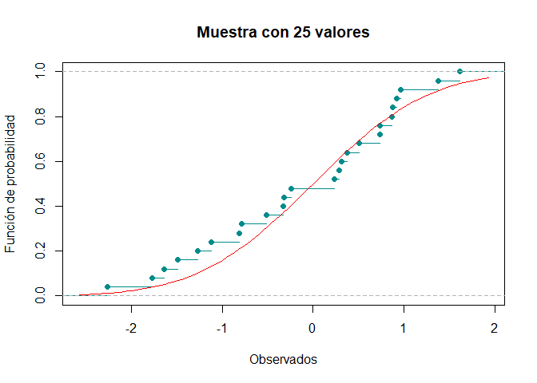
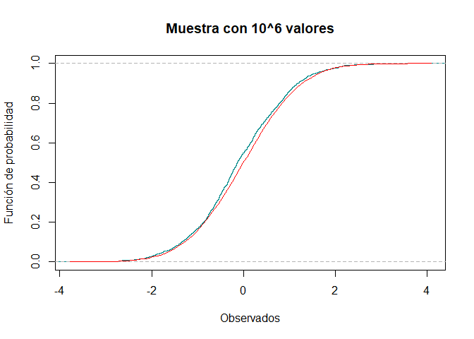
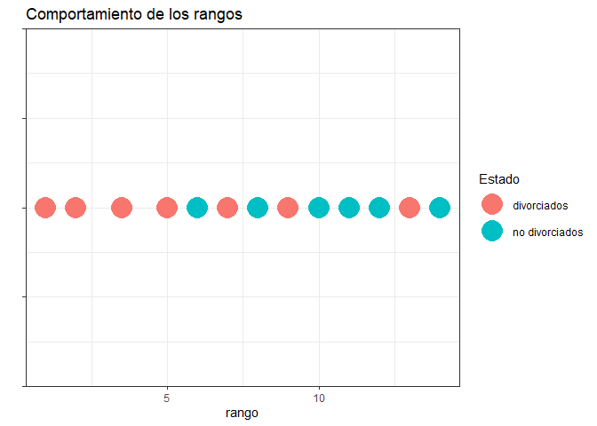

## Pruebas de bondad de ajuste
## Problema 3
La siguiente muestra aleatoria hace referencia a los rendimientos positivos de
cierta acciC3n a lo largo del tiempo.

0.2513, 0.2566, 0.3459, 0.6379, 2.0505, 1.803, 2.1906,
1.5299, 0.35005, 0.3128, 1.2726, 2.3674, 2.3214, 2.4373, 0.6548

Llamamos a la libreria nortest para hacer la prueba lilliforce hasta el final.

```r
library(nortest)
```
Ho: La muestra sigue una distribuciC3n normal VS Ha: La muestra no sigue una distribuciC3n normal

Metemos los datos en un vector y ordenamos los datos.


```r
Dirty_data=c(0.2513, 0.2566, 0.3459, 0.6379, 2.0505, 1.803, 2.1906,
             1.5299, 0.35005, 0.3128, 1.2726, 2.3674, 2.3214, 2.4373, 0.6548)
Data=sort(Dirty_data)
```


```
##  [1] 0.25130 0.25660 0.31280 0.34590 0.35005 0.63790 0.65480 1.27260 1.52990
## [10] 1.80300 2.05050 2.19060 2.32140 2.36740 2.43730
```


Como queremos probar normalidad pero no sabemos los parC!metros tenemos que estimarlos, primero queremos hacer una funciC3n para calcular la varianza muestral.


```r
S2<-function(x){
  mean_aux=mean(x)
  n_aux=length(x)
  s2=0
  for (i in x){
    s2=s2+(i-mean_aux)^2
  }
  s2=s2/(n_aux-1)
  return(s2)
}
```

Calculamos los estimadores mC!ximos verosC-miles. 


```r
mean_est=mean(Data)
S2_est=S2(Data)
n=length(Data)
```


```
## [1] 1.252137
```

```
## [1] 0.7810794
```

```
## [1] 15
```

Calculamos la funciC3n de distribuciC3n empC-rica necesaria para la prueba de lillieforce, donde "ecdf" es la funciC3n para crear la distribuciC3n empC-rica, "f_n" son los percentiles de la distribuciC3n empC-rica y "f_r" son los percentiles de la distribuciC3n pero desplazados una unidad. 


```r
f_emp=ecdf(Data)
f_n=f_emp(Data)
f_r=f_n-(1/n) 
```

Para para prueba de lillieforce necesitamos estandarizar los datos. 


```r
Z=(Data-mean_est)/sqrt(S2_est)
```


```
##  [1] -1.13244110 -1.12644418 -1.06285419 -1.02540173 -1.02070603 -0.69500536
##  [7] -0.67588310  0.02315415  0.31428766  0.62329879  0.90334365  1.06186602
## [13]  1.20986549  1.26191423  1.34100569
```

Ahora usaremos la funciC3n de distribuciC3n de una normal estandar para los valores antes calculados. 


```r
Probas=pnorm(Z)
```


```
##  [1] 0.1287245 0.1299888 0.1439240 0.1525868 0.1536969 0.2435260 0.2495574
##  [8] 0.5092363 0.6233487 0.7334559 0.8168282 0.8558517 0.8868347 0.8965102
## [15] 0.9100407
```


Tenemos que calcular: $$ \frac{i}{n} - D_{i}^{+}=  \phi(Z_{i}) $$  
$$D_{i}^{-}=  \phi(Z_{i}) - \frac{i-1}{n}$$


```r
Di_p=f_n  -Probas
Di_n= Probas - f_r
```

Visualizamos todos los cC!lculos. 


```r
Visual=data.frame(Dirty_data,Data,Z,Probas,Di_p,Di_n)
```


```
##    Dirty_data    Data           Z    Probas         Di_p        Di_n
## 1     0.25130 0.25130 -1.13244110 0.1287245 -0.062057851  0.12872452
## 2     0.25660 0.25660 -1.12644418 0.1299888  0.003344555  0.06332211
## 3     0.34590 0.31280 -1.06285419 0.1439240  0.056075960  0.01059071
## 4     0.63790 0.34590 -1.02540173 0.1525868  0.114079830 -0.04741316
## 5     2.05050 0.35005 -1.02070603 0.1536969  0.179636464 -0.11296980
## 6     1.80300 0.63790 -0.69500536 0.2435260  0.156474028 -0.08980736
## 7     2.19060 0.65480 -0.67588310 0.2495574  0.217109233 -0.15044257
## 8     1.52990 1.27260  0.02315415 0.5092363  0.024096990  0.04256968
## 9     0.35005 1.52990  0.31428766 0.6233487 -0.023348715  0.09001538
## 10    0.31280 1.80300  0.62329879 0.7334559 -0.066789235  0.13345590
## 11    1.27260 2.05050  0.90334365 0.8168282 -0.083494899  0.15016157
## 12    2.36740 2.19060  1.06186602 0.8558517 -0.055851744  0.12251841
## 13    2.32140 2.32140  1.20986549 0.8868347 -0.020168078  0.08683474
## 14    2.43730 2.36740  1.26191423 0.8965102  0.036823158  0.02984351
## 15    0.65480 2.43730  1.34100569 0.9100407  0.089959302 -0.02329264
```

Definimos $$D^{+}= max\{D_{i}^{+}\}$$ $$D^{-}= max\{D_{i}^{-}\}$$ 
 

```r
D_p=max(Di_p)
D_n=max(Di_n)
```


```
## [1] 0.2171092
```

```
## [1] 0.1501616
```

Definimos $$D= max\{ D^{+}, D^{-} \}$$


```r
Dn=max(D_p,D_n)
```


```
## [1] 0.2171092
```


Declaramos nuestro nivel de significancia $$\alpha = 0.10$$ entonces $$1-\alpha = 0.90$$.


Comparamos con el nivel crC-tico $$ W_{0.10}^{15}= 0.2016 $$, para el tamaC1o de muestra 15 en tablas.


```r
Est=0.2016
Rechazamos_H0=Dn>Est
```


```
## [1] TRUE
```

Como $$D > W_{0.10}^{15}$$, rechazamos Ho y por lo tanto no hay evidencia para que los datos sigan una distribuciC3n $$ N(\mu,\sigma^2) $$

Hacemos la prueba en unas lC-neas. 


```r
p_value=lillie.test(Data)[[2]]

Rechazamos_p_value=p_value<alpha
```


```
## [1] 0.05540837
```

```
## [1] TRUE
```

Confirmando la prueba anterior. 


El gerente del banco asume que la muestra se distribuye sigue una distribuciC3n lognormal con media 0 y varianza 1. Realice la prueba correspondiente para verificar la suposiciC3n del gerente con un nivel de significancia alpha = 0.01. 

Llamamos a la funciC3n de distribuciC3n de una lognormal.


```r
ProbasB=plnorm(Data) 
```


```
##  [1] 0.0836229 0.0868775 0.1225789 0.1442074 0.1469328 0.3265089 0.3359924
##  [8] 0.5952465 0.6646554 0.7222209 0.7636471 0.7835314 0.8001537 0.8055991
## [15] 0.8135061
```

Calculamos $ D_{i}^{+}$ y $D_{i}^{-} $


```r
Di_pB=abs(ProbasB-f_n)
Di_nB=abs(ProbasB-f_r)
```

Ahora para $D^{+} \quad D^{-}$


```r
D_pB=max(Di_pB)
#Calculamos D-
D_nB=max(Di_nB)
```

Entonces obtenemos $D$

```r
DnB=max(D_pB,D_nB)
```


```
## [1] 0.1864939
```

Declaramos nuestro nivel de significancia $$\alpha = 0.01$$ entonces $$1-\alpha = 0.99$$. 


Tenemos que en tablas $$W_{0.01}^{15}=0.40420$$


```r
EstB=0.40420

Rechazamos_H0B=DnB>EstB
```


```
## [1] FALSE
```

Se cumple que $$W_{0.01}^{15} > D$$ entonces no hay evidencia para rechazar Ho, entonces 
los datos siguen una distribuciC3n lognormal con media de 1 y varianza 0.

Usamos la prueba especC-ficando la distribuciC3n lognormal con sus parC!metros.


```r
p_valueB=ks.test(Data,plnorm,0,1)[[2]]

Rechazamos_p_valueB=p_valueB<alphaB
```


```
## [1] 0.6089758
```

```
## [1] FALSE
```

Confirmamos la prueba anterior. 


## Pruebas de bondad de ajuste
## Problema 4


Un cierto banco otorga crC)dito a las personas con una tasa preferencial, de tal
manera que los acreditados pueden pagar en cualquier momento desde que piden
el prestamo hasta 8 semanas posteriores para que les sea respetada la tasa
preferencial . Se seleccionaron aleatoriamente a 1,000 personas y observaron su
comportamiento, generando de esta manera la siguiente tabla de frecuencia:


```r
intervalos <- c( "Menos de 1 semana","1<= x <2" , "2<= x <3","3<= x <4","4<= x <5","5<= x <6","6<= x <7","7<= x <8","MC!s de 8 semanas")
oi <- c(64,195,287,241,140,51,25,4,1)

tabla <- data.frame(oi,row.names = intervalos )
tabla
```

```
##                    oi
## Menos de 1 semana  64
## 1<= x <2          195
## 2<= x <3          287
## 3<= x <4          241
## 4<= x <5          140
## 5<= x <6           51
## 6<= x <7           25
## 7<= x <8            4
## MC!s de 8 semanas   1
```

Observamos la cantidad real de personas. 

```r
k=sum(oi)
print(k)
```

```
## [1] 1008
```

Sea X v.a. que modela semanas completas que se tarda el cliente en hacer el pago. 

Enunciamos la prueba de hipC3tesis: 

Ho: Se sigue una distribuciC3n Bin(n=10,p=0.25)  VS   Ha: No se sigue una distribuciC3n Bin(n=10,p=0.25)

Nuestros parC!metros son: 


```r
p=0.25
n=10
```
Los datos se agruparon en nueve diferentes clasificaciones $c_{i} \quad i\in \{0,1,...,8 \}$.


```r
length(oi)
```

```
## [1] 9
```


Nuestras observaciones fueron: 


```r
oi=c(64,195,287,241,140,51,25,4,1)
```

Calculamos las probabilidades $p_{i}$ con la distribuciC3n que propusimos, se itera desde cero ya que tenemos la clasificaciC3n 0. 


```
## [1] 0.056313515 0.187711716 0.281567574 0.250282288 0.145998001 0.058399200
## [7] 0.016222000 0.003089905 0.000415802
```
Verificamos que las probas suman 1. 
$$\sum_{i=0}^{8} p_{i} = 1$$


```r
sum(Probas_ejercicio4)
```

```
## [1] 1
```
Ahora calculamos las frecuencias esperadas. 

$$n * p_{i}$$

```r
ei= Probas_ejercicio4 * k 
print(ei)
```

```
## [1]  56.7640228 189.2134094 283.8201141 252.2845459 147.1659851  58.8663940
## [7]  16.3517761   3.1146240   0.4191284
```

Podemos visualizar toda la informaciC3n. 


```r
Tabla_ji = data.frame("ci"=0:8, "oi"=oi,"pi"= Probas_ejercicio4,"ei"=ei)
print(Tabla_ji)
```

```
##   ci  oi          pi          ei
## 1  0  64 0.056313515  56.7640228
## 2  1 195 0.187711716 189.2134094
## 3  2 287 0.281567574 283.8201141
## 4  3 241 0.250282288 252.2845459
## 5  4 140 0.145998001 147.1659851
## 6  5  51 0.058399200  58.8663940
## 7  6  25 0.016222000  16.3517761
## 8  7   4 0.003089905   3.1146240
## 9  8   1 0.000415802   0.4191284
```

Vamos a calcular nuestra estadC-stica de prueba. 
$$T= \sum _{i=0}^{8} \frac{(o_{i}-e_{i})^{2}}{e_{i}}$$


```r
EstJi=0 
for (i in 1:9){
  EstJi=EstJi+(((oi[i]) - (ei[i]))^2)/(ei[i])
}
print(EstJi)
```

```
## [1] 8.670518
```
Se comienza el ciclo desde 1 hasta 9 ya que son las entradas de los vectores, no son las clasificaciones. 

Para un nivel de confianza $\alpha = 0.01 $ tenemos que $1-\alpha = 0.99$. 


```r
alpha_ejercicio4=0.01
conf_ejercicio4= 1- alpha_ejercicio4
```

Necesitamos los grados de libertad, que es el nC:mero de clasificaciones menos uno, ya que no estimamos parC!metros. 


```
## [1] 8
```
Calculamos el cuantil ${\chi}^2_{8,\ 0.99}$.

```r
valor_critico=qchisq(conf_ejercicio4,df=v,lower.tail = TRUE)
```
Comparamos la estadC-stica de prueba con el valor crC-tico. 

```r
Rechazamos_H0_p4=EstJi>valor_critico
print(Rechazamos_H0_p4)
```

```
## [1] FALSE
```

No hay evidencia pra decir que los datos no siguien una distribuciC3n binomial con n=10 y p=0.25, entonces aceptamos Ho. 

Para comprobar los cC!lculos usemos la prueba que vienen en la libreria nortest. 


```r
p_value_p4=chisq.test(x=oi,p=Probas_ejercicio4)[[3]]
```

```
## Warning in chisq.test(x = oi, p = Probas_ejercicio4): Chi-squared approximation
## may be incorrect
```

```r
Rechazamos_p_value_p4=alpha_ejercicio4>p_value_p4
print(Rechazamos_p_value_p4)
```

```
## [1] FALSE
```
No rechazamos Ho. 

## Pruebas de bondad de ajuste
## Problema 5


En R fije la semilla 2019, y genera 25 observaciones distribuidas como una N(0; 1)
y con ella realiza:

Calcula y grC!fica la funciC3n de distribuciC3n empC-rica de las observaciones
generadas.

Agrega sobre esa misma grC!fica, la curva de la distribuciC3n verdadera (N(0; 1)).
A partir de las grC!ficas anteriores B?La funciC3n de distribuciC3n empC-rica es
similar a la distribucin teC3rica de los datos?.

Vuelve a fijar la semilla 2019, y genera un millC3n de observaciones distribuidas como una N(0; 1) y con ello realiza:

Calcula y grC!fica la funciC3n de distribuciC3n empC-rica de las observaciones generadas.

Agrega sobre esa misma grC!fica, la curva de la distribuciC3n verdadera (N(0; 1)).
A partir de las grC!ficas anteriores B?La funciC3n de distribuciC3n empC-rica es similar a la distribuciC3n teC3rica de los datos?.

Realiza la diferencia entre el valor de la funciC3n empC-rica y la funciC3n real,
(Hint: no olvides que debes ordenar de menor a mayor los valores de la distribuciC3n conocida y sC3lo mostrar los primeros 5 y los C:ltimos 5 resultados)

B?Al ser una muestra mucho mayor que al anterior a que teorema te recuerda
el resultado obtenido?.


Para la primera parte del ejercicio fijemos la semilla inicial.

```r
set.seed(2019)
```

Obtengamos 25 datos de una distribuciC3n normal estC!ndar.

```r
x_data=rnorm(25,mean=0,sd=1)
print(x_data)
```

```
##  [1]  0.7385227 -0.5147605 -1.6401813  0.9160368 -1.2674820  0.7382478
##  [7] -0.7826228  0.5092959 -1.4899391 -0.3191793 -0.2379111  1.6186229
## [13] -1.1176011  0.2340028  0.3161516  0.3707686  0.8775886 -1.7683235
## [19] -0.3271264 -2.2632252  0.2855605  0.9684286  0.8673066  1.3781350
## [25] -0.8082596
```
Calculemos la funciC3n de distribuciC3n empC-rica y obtengamos su grC!fica.


```r
f_empi=ecdf(x_data)
plot(f_empi, xlab="Observados", ylab="FunciC3n de probabilidad", 
     main="Muestra con 25 valores", col="darkcyan")
curve(pnorm(x), add=TRUE, col="red")
```

<!-- -->


Las funciones se parecen aunque pareciera que el error el algo grande ya que no son idC)nticas, del lado de los negativos se aprecia mC!s despegada en cambio para valores mayores a cero se ajustan mejor a la funciC3n de distribuciC3n de una $N(0,1)$. 

Vamos con la segunda parte del ejercicio, primero volvemos a fijar la semilla. 


```r
set.seed(2019)
```

Generamos un millC3n de datos de una distribuciC3n $N(0,1)$.


```r
x_dataM = rnorm(10^3)
```
Calculamos la funciC3n de distribuciC3n empC-rica $F_{n}$


```r
f_empiM = ecdf(x_dataM)
```

Veamos las grC!ficas: 


```r
plot(f_empiM, xlab="Observados", ylab="FunciC3n de probabilidad", 
     main="Muestra con 10^6 valores", col="darkcyan")
curve(pnorm(x), add=TRUE, col="red")
```

<!-- -->

En este caso para una muestra de tamaC1o $10^6$, ambas funciones se parecen mucho, apenas se alcanzan a ver los puntos en los que difieren. 

Trabajemos con la muestra tamaC1o 25, ahora vamos a ver como se comportan los datos en relaciC3n con la funciC3n empC-rica y real, primero debemos ordenar los datos.


```r
x_data_ord=sort(x_data)
f_empi_norm=f_empi(x_data_ord)
```

Calculemos la funciC3n empC-rica con un lugar desfasado (salto de $\frac{1}{25}$).


```r
f_empi_des=f_empi_norm - (1/25)
```

Calculemos las probabilidades de la muestra suponiendo una distribuciC3n $N(0,1)$. 


```r
probras_data = pnorm(x_data_ord)
```

Primero vamos con $D^{+}$.


```r
D_data_norm = f_empi_norm - probras_data
D_data_max = max(D_data_norm)
print(D_data_max)
```

```
## [1] 0.1081313
```

Ahora para $D^{-}$


```r
D_data_des = probras_data - f_empi_des
D_data_des_max = max(D_data_des)
print(D_data_des_max)
```

```
## [1] 0.1125086
```
Ahora calculamos $D = max \{D^{+},D^{-}  \}= \sup |F_{n}(x) - F(x) |$, que es la diferencia entre la funciC3n de distribuciC3n empC-rica y teC3rica, al final vamos a comparar con la de la simulaciC3n $10^{6}$. 


```r
D_max= max(D_data_max,D_data_des_max)
print(D_max)
```

```
## [1] 0.1125086
```
Veamos la informaciCiC3n:


Mostremos los 5 primeros datos y C:ltimos 5: 


```r
print(head(valores_25))
```

```
##       x_data x_data_ord probras_data D_data_norm   D_data_des
## 1  0.7385227  -2.263225   0.01181090  0.02818910  0.011810905
## 2 -0.5147605  -1.768324   0.03850342  0.04149658 -0.001496583
## 3 -1.6401813  -1.640181   0.05048373  0.06951627 -0.029516266
## 4  0.9160368  -1.489939   0.06812013  0.09187987 -0.051879873
## 5 -1.2674820  -1.267482   0.10249150  0.09750850 -0.057508497
## 6  0.7382478  -1.117601   0.13186870  0.10813130 -0.068131302
```

```r
print(tail(valores_25))
```

```
##        x_data x_data_ord probras_data  D_data_norm   D_data_des
## 20 -2.2632252  0.8673066    0.8071130 -0.007112981  0.047112981
## 21  0.2855605  0.8775886    0.8099165  0.030083517  0.009916483
## 22  0.9684286  0.9160368    0.8201762  0.059823801 -0.019823801
## 23  0.8673066  0.9684286    0.8335848  0.086415187 -0.046415187
## 24  1.3781350  1.3781350    0.9159192  0.044080808 -0.004080808
## 25 -0.8082596  1.6186229    0.9472358  0.052764213 -0.012764213
```

Vamos a hacer lo mismo para los datos de la simulaciC3n $10^{6}$, y despuC)s vamos comparar las $D$. Ordenamos la muestra. 


```r
x_dataM_ord = sort(x_dataM)
f_empi_M= f_empiM(x_dataM_ord)
```

Calculamos la funciciC3n desfasada ($\frac{1}{10^6}$).


```r
f_empi_M_des = f_empi_M - (1/(10^3))
```

Calculamos las probas bajo una distribuciones $N(0,1)$.


```r
probas_dataM = pnorm(x_dataM_ord)
```

Calculamos $D^{+}=\max \{F_{n}(x_{i}) - F(x_{i}) \}$. 


```r
D_dataM_norm = f_empi_M - probas_dataM
D_dataM_norm_max = max(D_dataM_norm)
print(D_dataM_norm_max)
```

```
## [1] 0.05626327
```

Calculamos $D^{-}=\max \{F(x_{i}) - F_{n}(x_{i-1}) \}$. 


```r
D_dataM_des = probas_dataM - f_empi_M_des
D_dataM_des_max = max(D_dataM_des)
print(D_data_des_max)
```

```
## [1] 0.1125086
```
Ahora calculamos $D$.

```r
D_maxM = max(D_dataM_norm_max, D_data_des_max)
print(D_data_des_max)
```

```
## [1] 0.1125086
```


Mostremos los 5 primeros datos y C:ltimos 5: 


```r
print(head(valores_M))
```

```
##      x_dataM x_dataM_ord probas_dataM D_dataM_norm   D_dataM_des
## 1  0.7385227   -3.236082 0.0006059136 0.0003940864  0.0006059136
## 2 -0.5147605   -3.186318 0.0007204796 0.0012795204 -0.0002795204
## 3 -1.6401813   -3.096515 0.0009790485 0.0020209515 -0.0010209515
## 4  0.9160368   -2.699617 0.0034709701 0.0005290299  0.0004709701
## 5 -1.2674820   -2.693624 0.0035339936 0.0014660064 -0.0004660064
## 6  0.7382478   -2.665872 0.0038394508 0.0021605492 -0.0011605492
```

```r
print(tail(valores_M))
```

```
##         x_dataM x_dataM_ord probas_dataM  D_dataM_norm  D_dataM_des
## 995  -0.2995747    2.636017    0.9958057 -0.0008057174 0.0018057174
## 996  -0.6456850    2.806820    0.9974983 -0.0014983415 0.0024983415
## 997  -0.9405533    2.833338    0.9976968 -0.0006967652 0.0016967652
## 998   1.0624081    3.029837    0.9987766 -0.0007765718 0.0017765718
## 999  -0.7634958    3.262782    0.9994484 -0.0004483775 0.0014483775
## 1000  0.9604393    3.541459    0.9998010  0.0001989603 0.0008010397
```


## Pruebas de Wilcoxon / Kruskal Wallis / Medidas de correlacion
## Problema 1

1.- La oficina de Censo reportC3 que se espera que los hispanos sobrepasen a los
afroamericanos como la minorC-a mC!s grande en los Estados Unidos para el aC1o
2030. Use dos pruebas diferentes para ver si hay una relaciC3n directa entre el
numero de Hispanos y el procentaje de la poblaciC3n del estado para los nueve
estados. California, Texas, New York, Florida, Illinois, Arizona, New Jersey, New MC)xico, Colorado.

Necesitamos los datos de dos muestras independientes y queremos ver si vienen de la misma poblaciC3n.En este caso los datos vienen por estado en ese orden. 


```r
library(dplyr)
```

```
## 
## Attaching package: 'dplyr'
```

```
## The following objects are masked from 'package:stats':
## 
##     filter, lag
```

```
## The following objects are masked from 'package:base':
## 
##     intersect, setdiff, setequal, union
```

```r
porcentaje=c(23,24,12,12,7,18,8,35,11)
hispanos=c(6.6,4.1,2.1,1.5,0.8,0.6,0.6,0.5,0.4)
```

Vamos a meter los vectores en un data frame. 


```r
paises<-data.frame(hispanos,porcentaje)
paises
```

```
##   hispanos porcentaje
## 1      6.6         23
## 2      4.1         24
## 3      2.1         12
## 4      1.5         12
## 5      0.8          7
## 6      0.6         18
## 7      0.6          8
## 8      0.5         35
## 9      0.4         11
```

Vamos a calcular los rangos considerando a $X$ e $y$ como una sola muestra aleatoria, para calcularle los rangos. 


```r
paises$R_x = rank(paises$hispanos)
paises$R_y=rank(paises$porcentaje)
print(paises)
```

```
##   hispanos porcentaje R_x R_y
## 1      6.6         23 9.0 7.0
## 2      4.1         24 8.0 8.0
## 3      2.1         12 7.0 4.5
## 4      1.5         12 6.0 4.5
## 5      0.8          7 5.0 1.0
## 6      0.6         18 3.5 6.0
## 7      0.6          8 3.5 2.0
## 8      0.5         35 2.0 9.0
## 9      0.4         11 1.0 3.0
```
Planteamos la prueba de hipotesis (prueba de una cola tipo c).

$H_{0}$:$\rho ??? 0$, existe una tendencia para que los valores mas grandes de X esten emparejados con los valores mas chicos de $Y$, y que los valores mas chicos de $X$ esten emparejados con los valores mas grandes de $Y$.

$H_{a}$:$p<0$ 

Obtenemos las diferencias entre los rangos en error cuadratico, que nos sirve para calcular $T$, estadC-stica de prueba. $$T= \sum_{i=1}^{n} (R(X_{i}) - R(Y_{i})    ) $$


```r
paises$diff_c = (paises$R_x - paises$R_y)^2 
estadistica= sum(paises$diff_c)
n_tamanio=length(paises$porcentaje)
```

Ahora vamos a calcular $\rho$ de Spearman. 

$$ 1- \frac{6T}{n(n^{2}-1 )}$$

```r
rho_Spearman = 1 - (6 * estadistica ) / (n_tamanio*(n_tamanio^2 -1 ) )
print(rho_Spearman)
```

```
## [1] 0.25
```
Definimos el nivel de significancia $\alpha$.


```r
alpha_spear= 0.05
conf_spear = 1- alpha_spear 
```
Ahora veamos que se rechaza Ho si $\rho < \omega_{\alpha}= 0.6$,se busco el cuantil en tablas.


```r
Rechazamos_H0_spear=rho_Spearman>0.6
print(Rechazamos_H0_spear)
```

```
## [1] FALSE
```
Por lo anterior, debemos aceptar $H_{0}$, entonces la poblaci??n tiene una correlaci??n $\rho ??? 0$.


Hacemos el test para comprobar la respuesta. 


```r
test_spear=cor.test(porcentaje, hispanos,method="spearman",alternative="greater")
```

```
## Warning in cor.test.default(porcentaje, hispanos, method = "spearman",
## alternative = "greater"): Cannot compute exact p-value with ties
```

```r
p_value=test_spear$p.value
print(p_value)
```

```
## [1] 0.2637307
```
Entonces aceptamos $H_{0}$ ya que $p-value>\alpha= 0.05$.

Vamos a hacer la prueba por Kendall, para comprobar nuestros datos. Tenemos que hacer la prueba con el test de la paqueterC-a nortest. 

```r
test_ken=cor.test(hispanos, porcentaje,method="kendall",alternative="greater",exact = NULL)
```

```
## Warning in cor.test.default(hispanos, porcentaje, method = "kendall",
## alternative = "greater", : Cannot compute exact p-value with ties
```

```r
print(test_ken$p.value)
```

```
## [1] 0.2635765
```
Como el $p-value>alpha$ entonces aceptamos $H_{0}$, como en la prueba de Spearman. 

Entonces concluimos que los datos tienen una corrlacipon positiva (mejor dicho no negativa), ya que $p???0$ con un nivel de confianza $\alpha=0.05$.


## Pruebas de correlaciC3n de rango   
## Problema 2 


Un psicologo esta investigando el impacto que el divorcio de los padres tiene sobre el aprovechamiento acadC)mico de los niC1os. El psicologo cuenta con las calicaciones de un grupo de niC1os de escuela primaria cuyos padres tuvieron un divorcio durante el aC1o anterior, y las calicaciones para un grupo de niC1os similares cuyos padres no se divorciaron.

La prueba de Mann-Whitney-Wilcoxon es una prueba no parametrica que es usada
cuando se tienen dos muestras aleatorias independientes y se desea probar que estas
provienen de una misma poblacion, es decir, se observara si existe evidencia con un
nivel signicancia $\alpha$, que dos muestras aleatorias independientes son iguales entre si.

Creamos los vectores con los datos.


```r
library(ggplot2)
nodivorciados=c(80, 72, 99 ,82 ,62 ,50 ,85)
divorciados= c(60, 70, 88, 75, 42, 30, 50)
```

Planteamos la prueba de hipC3tesis como: 

$H_{0}$: Las muestras vienen de la misma poblaciC3n, es decir, $E[X]=E[Y]$. 

$H_{a}$: Las muestras no vienen de la misma poblaciC3n.

Obtenemos el tamaC1o de la muestra, para este caso ambas muestras tienen el mismo tamaC1o, entonces $n_{1}=n_{2}$.


```r
n_tamanio_muestra=length(nodivorciados)
```


Hacemos las muestras una sola, las juntamos para darles un rango dentro de un data frame. 


```r
datos_div = data.frame(Estado =rep(c("no divorciados", "divorciados"), 
                              each = n_tamanio_muestra),
                              Promedio= c(nodivorciados, divorciados))
print(datos_div)
```

```
##            Estado Promedio
## 1  no divorciados       80
## 2  no divorciados       72
## 3  no divorciados       99
## 4  no divorciados       82
## 5  no divorciados       62
## 6  no divorciados       50
## 7  no divorciados       85
## 8     divorciados       60
## 9     divorciados       70
## 10    divorciados       88
## 11    divorciados       75
## 12    divorciados       42
## 13    divorciados       30
## 14    divorciados       50
```

Vamos a obtener los rangos y a visualizarlos: 


```r
datos_div$rango=rank(datos_div$Promedio)
print(datos_div)
```

```
##            Estado Promedio rango
## 1  no divorciados       80  10.0
## 2  no divorciados       72   8.0
## 3  no divorciados       99  14.0
## 4  no divorciados       82  11.0
## 5  no divorciados       62   6.0
## 6  no divorciados       50   3.5
## 7  no divorciados       85  12.0
## 8     divorciados       60   5.0
## 9     divorciados       70   7.0
## 10    divorciados       88  13.0
## 11    divorciados       75   9.0
## 12    divorciados       42   2.0
## 13    divorciados       30   1.0
## 14    divorciados       50   3.5
```

Debemos obtener las sumas de los rangos. 

$$R_{1}=\sum _{i=1}^{n_{1}} R(X_{i}) \quad   R_{2}=\sum _{i=1}^{n_{2}} R(Y_{i}) $$

```r
suma_rango<-datos_div %>% group_by(Estado) %>% summarise(suma_rango = sum(rango))
rango_div<-suma_rango$suma_rango[1]
rango_nodiv<-suma_rango$suma_rango[2]
print(suma_rango)
```

```
## # A tibble: 2 x 2
##   Estado         suma_rango
##   <chr>               <dbl>
## 1 divorciados          40.5
## 2 no divorciados       64.5
```

Podemos ver la distribucion de los rangos: 


```r
ggplot(data = datos_div , aes(x = rango , y=0)) + 
  geom_point(aes(colour = Estado), size = 8) + 
  ggtitle("Comportamiento de los rangos")+ ylab("") + 
  xlab("rango") +theme_bw() + theme(axis.text.y = element_blank())
```

<!-- -->


Procedemos a calcular $U_{1}, \ U_{2}$. 
$$U_{1}= n_{1} \ n_{2} + \frac{n_{1} (n_{1}-1)}{2} - R_{1}$$
$$U_{2}= n_{1} \ n_{2} + \frac{n_{2} (n_{2}-1)}{2} - R_{2}$$
Recordamos que $n_{1}=n_{2}$, entonces el factor al que se le debe restar $R_{1}, \  R_{2}$ es el mismo.

```r
factor_us= n_tamanio_muestra*n_tamanio_muestra+(n_tamanio_muestra*(n_tamanio_muestra+1))/2
```

Calculamos $U_{1}, \ U_{2}$. 

```r
U_div=factor_us - rango_div
U_nd=factor_us - rango_nodiv
print(U_div)
```

```
## [1] 36.5
```

```r
print(U_nd)
```

```
## [1] 12.5
```
Recordamos que $U=\min(U_{1},U_{2} )$.


```r
U_est= min(U_div,U_nd)
```

Como suponemos que los datos vienen de la distribucion normal, obtengamos la esperanza y varianza de $U$, que ser??n los par??metros para la distribucion normal, como se sugiere en las notas.

$$E[U]= \frac{n_{1}n_{2} }{2}$$
$$Var[U] = \frac{n_{1}n_{2}}{12}(n_{1}+n_{2}+1) $$

```r
mu_div = (n_tamanio_muestra^2)/2
sigma_div = (n_tamanio_muestra^2 / 12 )*(n_tamanio_muestra+n_tamanio_muestra+1)
```

Por ser una prueba de dos colas para $\alpha= 0.05 $ tenemos que ver que pasa con los cuantiles $\frac{\alpha}{2}, \ 1-\frac{\alpha}{2}$, recordamos que la distribuci??n normal es simetrica.


```r
alpha_div = 0.05
z_izq=qnorm(alpha_div/2,mean=mu_div,sd=sqrt(sigma_div))
z_der=qnorm(1-alpha_div/2,mean=mu_div,sd=sqrt(sigma_div))
print(z_izq)
```

```
## [1] 9.160856
```

```r
print(z_der)
```

```
## [1] 39.83914
```

Rechazamos $H_{0}$, si $U< Z_{\alpha}$ o $U> Z_{1-\frac{\alpha}{2}}$. 


```r
Rechazamos_H0_div=(U_est < z_izq || U_est > z_der)
print(Rechazamos_H0_div)
```

```
## [1] FALSE
```
Por lo anterior aceptamos $H_{0}$, entonces los datos vienen de la misma poblaci??n. No hay una diferencia en el aprovechamiento de los ni??os, con un $\alpha=0.05$ de confianza. 


Para comprobar lo anterior tenemos que ver la prueba de paqueteria nortest. 


```r
prueba_wilcox = wilcox.test(divorciados, nodivorciados, paired=FALSE)
```

```
## Warning in wilcox.test.default(divorciados, nodivorciados, paired = FALSE):
## cannot compute exact p-value with ties
```

```r
print(prueba_wilcox$p.value)
```

```
## [1] 0.1412821
```
Como el $p-value>0.05$ aceptamos $H_{0}$, entonces las muestras vienen de la misma poblacion. 


## Pruebas de correlacion de rango 
## Problema 3
La tabla que se proporciona a continuacion da el nC:mero de premios de postgraduados en ciencia medica y la razon de muerte por millon de tuberculosis para 1959-69.

Demuestre que estos datos muestran una fuerte evidencia de correlacion negativa
entre el numero de premios y la tasa de muerte por tuberculosis. Explique este resultado. Use $\alpha=0.05$.

Primero veamos los datos en un data frame.


```r
tasa_muerte<-c(83,74,71,65,62,52,47,48,42,43,38)
anio<-c(1959,1960,1961,1962,1963,1964,1965,1966,1967,1968,1969) 
premios<-c(277,318,382,441,486,597,750,738,849,932,976)
Datos_tuber<-data.frame(anio,premios,tasa_muerte)
print(Datos_tuber)
```

```
##    anio premios tasa_muerte
## 1  1959     277          83
## 2  1960     318          74
## 3  1961     382          71
## 4  1962     441          65
## 5  1963     486          62
## 6  1964     597          52
## 7  1965     750          47
## 8  1966     738          48
## 9  1967     849          42
## 10 1968     932          43
## 11 1969     976          38
```

Queremos ver si se tiene una correlacion negativa (es una prueba tipo B), entonces proponemos la prueba de hipotesis:

$H_{0}$: $\rho ???0$ VS $H_{a}$: $\rho>0$


 

## Pruebas de correlacion de rango 
## Problema 4


