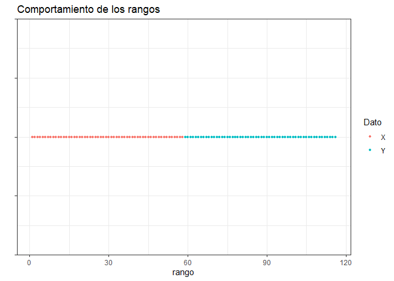

## Pruebas de bondad de ajuste
## Problema 3
La siguiente muestra aleatoria hace referencia a los rendimientos positivos de
cierta acción a lo largo del tiempo.

0.2513, 0.2566, 0.3459, 0.6379, 2.0505, 1.803, 2.1906,
1.5299, 0.35005, 0.3128, 1.2726, 2.3674, 2.3214, 2.4373, 0.6548

Llamamos a la libreria nortest para hacer la prueba lilliforce hasta el final.

```r
library(nortest)
library(dplyr)
```

```
## 
## Attaching package: 'dplyr'
```

```
## The following objects are masked from 'package:stats':
## 
##     filter, lag
```

```
## The following objects are masked from 'package:base':
## 
##     intersect, setdiff, setequal, union
```

```r
library(ggplot2)
```


Ho: La muestra sigue una distribución normal VS Ha: La muestra no sigue una distribución normal.

Metemos los datos en un vector y ordenamos los datos.


```r
Dirty_data=c(0.2513, 0.2566, 0.3459, 0.6379, 2.0505, 1.803, 2.1906,
             1.5299, 0.35005, 0.3128, 1.2726, 2.3674, 2.3214, 2.4373, 0.6548)
Data=sort(Dirty_data)
```


```
##  [1] 0.25130 0.25660 0.31280 0.34590 0.35005 0.63790 0.65480 1.27260 1.52990
## [10] 1.80300 2.05050 2.19060 2.32140 2.36740 2.43730
```


Como queremos probar normalidad pero no sabemos los parámetros tenemos que estimarlos, primero queremos hacer una función para calcular la varianza muestral.


```r
S2<-function(x){
  mean_aux=mean(x)
  n_aux=length(x)
  s2=0
  for (i in x){
    s2=s2+(i-mean_aux)^2
  }
  s2=s2/(n_aux-1)
  return(s2)
}
```

Calculamos los estimadores máximos verosímiles. 


```r
mean_est=mean(Data)
S2_est=S2(Data)
n=length(Data)
```


```
## [1] 1.252137
```

```
## [1] 0.7810794
```

```
## [1] 15
```

Calculamos la función de distribución empírica necesaria para la prueba de lillieforce, donde "ecdf" es la funciC3n para crear la distribuciC3n empírica, "f_n" son los percentiles de la distribución empC-rica y "f_r" son los percentiles de la distribución pero desplazados una unidad. 


```r
f_emp=ecdf(Data)
f_n=f_emp(Data)
f_r=f_n-(1/n) 
```

Para para prueba de lillieforce necesitamos estandarizar los datos. 


```r
Z=(Data-mean_est)/sqrt(S2_est)
```


```
##  [1] -1.13244110 -1.12644418 -1.06285419 -1.02540173 -1.02070603 -0.69500536
##  [7] -0.67588310  0.02315415  0.31428766  0.62329879  0.90334365  1.06186602
## [13]  1.20986549  1.26191423  1.34100569
```

Ahora usaremos la función de distribución de una normal estándar para los valores antes calculados. 


```r
Probas=pnorm(Z)
```


```
##  [1] 0.1287245 0.1299888 0.1439240 0.1525868 0.1536969 0.2435260 0.2495574
##  [8] 0.5092363 0.6233487 0.7334559 0.8168282 0.8558517 0.8868347 0.8965102
## [15] 0.9100407
```


Tenemos que calcular: $$ \frac{i}{n} - D_{i}^{+}=  \phi(Z_{i}) $$  
$$D_{i}^{-}=  \phi(Z_{i}) - \frac{i-1}{n}$$


```r
Di_p=f_n  -Probas
Di_n= Probas - f_r
```

Visualizamos todos los cálculos. 


```r
Visual=data.frame(Dirty_data,Data,Z,Probas,Di_p,Di_n)
```


```
##    Dirty_data    Data           Z    Probas         Di_p        Di_n
## 1     0.25130 0.25130 -1.13244110 0.1287245 -0.062057851  0.12872452
## 2     0.25660 0.25660 -1.12644418 0.1299888  0.003344555  0.06332211
## 3     0.34590 0.31280 -1.06285419 0.1439240  0.056075960  0.01059071
## 4     0.63790 0.34590 -1.02540173 0.1525868  0.114079830 -0.04741316
## 5     2.05050 0.35005 -1.02070603 0.1536969  0.179636464 -0.11296980
## 6     1.80300 0.63790 -0.69500536 0.2435260  0.156474028 -0.08980736
## 7     2.19060 0.65480 -0.67588310 0.2495574  0.217109233 -0.15044257
## 8     1.52990 1.27260  0.02315415 0.5092363  0.024096990  0.04256968
## 9     0.35005 1.52990  0.31428766 0.6233487 -0.023348715  0.09001538
## 10    0.31280 1.80300  0.62329879 0.7334559 -0.066789235  0.13345590
## 11    1.27260 2.05050  0.90334365 0.8168282 -0.083494899  0.15016157
## 12    2.36740 2.19060  1.06186602 0.8558517 -0.055851744  0.12251841
## 13    2.32140 2.32140  1.20986549 0.8868347 -0.020168078  0.08683474
## 14    2.43730 2.36740  1.26191423 0.8965102  0.036823158  0.02984351
## 15    0.65480 2.43730  1.34100569 0.9100407  0.089959302 -0.02329264
```

Definimos $$D^{+}= max\{D_{i}^{+}\}$$ $$D^{-}= max\{D_{i}^{-}\}$$ 
 

```r
D_p=max(Di_p)
D_n=max(Di_n)
```


```
## [1] 0.2171092
```

```
## [1] 0.1501616
```

Definimos $$D= max\{ D^{+}, D^{-} \}$$


```r
Dn=max(D_p,D_n)
```


```
## [1] 0.2171092
```


Declaramos nuestro nivel de significancia $$\alpha = 0.10$$ entonces $$1-\alpha = 0.90$$.


Comparamos con el nivel crítico $$ W_{0.10}^{15}= 0.2016 $$, para el tamaño de muestra 15 en tablas.


```r
Est=0.2016
Rechazamos_H0=Dn>Est
```


```
## [1] TRUE
```

Como $D > W_{0.10}^{15}$, rechazamos Ho y por lo tanto no hay evidencia para que los datos sigan una distribución $N(\mu,\sigma^2)$.

Hacemos la prueba en unas líneas. 


```r
p_value=lillie.test(Data)[[2]]

Rechazamos_p_value=p_value<alpha
```


```
## [1] 0.05540837
```

```
## [1] TRUE
```

Confirmando la prueba anterior. 


El gerente del banco asume que la muestra se distribuye sigue una distribuciC3n lognormal con media 0 y varianza 1. Realice la prueba correspondiente para verificar la suposición del gerente con un nivel de significancia $\alpha = 0.01$.

Llamamos a la funciC3n de distribución de una lognormal.


```r
ProbasB=plnorm(Data) 
```


```
##  [1] 0.0836229 0.0868775 0.1225789 0.1442074 0.1469328 0.3265089 0.3359924
##  [8] 0.5952465 0.6646554 0.7222209 0.7636471 0.7835314 0.8001537 0.8055991
## [15] 0.8135061
```

Calculamos $ D_{i}^{+}$ y $D_{i}^{-} $


```r
Di_pB=(f_n-ProbasB)
Di_nB=(ProbasB-f_r)
```

Ahora para $D^{+} \quad D^{-}$


```r
D_pB=max(Di_pB)
#Calculamos D-
D_nB=max(Di_nB)
```

Entonces obtenemos $D$.

```r
DnB=max(D_pB,D_nB)
```


```
## [1] 0.1864939
```

Declaramos nuestro nivel de significancia $\alpha = 0.01$ entonces $1-\alpha = 0.99$. 


Tenemos que en tablas $W_{0.01}^{15}=0.40420$.


```r
EstB=0.40420

Rechazamos_H0B=DnB>EstB
```


```
## [1] FALSE
```

Se cumple que $W_{0.01}^{15} > D$ entonces no hay evidencia para rechazar Ho, entonces 
los datos siguen una distribuciC3n lognormal con media de 1 y varianza 0.

Usamos la prueba especificando la distribuciC3n lognormal con sus parámetros.


```r
p_valueB=ks.test(Data,plnorm,0,1)[[2]]

Rechazamos_p_valueB=p_valueB<alphaB
```


```
## [1] 0.6089758
```

```
## [1] FALSE
```

Confirmamos la prueba anterior. 


## Pruebas de bondad de ajuste
## Problema 4


Un cierto banco otorga crédito a las personas con una tasa preferencial, de tal
manera que los acreditados pueden pagar en cualquier momento desde que piden
el prestamo hasta 8 semanas posteriores para que les sea respetada la tasa
preferencial. Se seleccionaron aleatoriamente a 1,000 personas y observaron su
comportamiento, generando de esta manera la siguiente tabla de frecuencia:


```r
intervalos <- c( "Menos de 1 semana","1<= x <2" , "2<= x <3","3<= x <4","4<= x <5","5<= x <6","6<= x <7","7<= x <8","MC!s de 8 semanas")
oi <- c(64,195,287,241,140,51,25,4,1)

tabla <- data.frame(oi,row.names = intervalos )
tabla
```

```
##                    oi
## Menos de 1 semana  64
## 1<= x <2          195
## 2<= x <3          287
## 3<= x <4          241
## 4<= x <5          140
## 5<= x <6           51
## 6<= x <7           25
## 7<= x <8            4
## MC!s de 8 semanas   1
```

Observamos la cantidad real de personas. 

```r
k=sum(oi)
print(k)
```

```
## [1] 1008
```

Sea X v.a. que modela semanas completas que se tarda el cliente en hacer el pago. 

Enunciamos la prueba de hipótesis: 

$Ho$: Se sigue una distribución $Bin(n=10,p=0.25)$  VS   $Ha$: No se sigue una distribución $Bin(n=10,p=0.25)$.

Nuestros parámetros son: 


```r
p=0.25
n=10
```
Los datos se agruparon en nueve diferentes clasificaciones $c_{i} \quad i\in \{0,1,...,8 \}$.


```r
length(oi)
```

```
## [1] 9
```


Nuestras observaciones fueron: 


```r
oi=c(64,195,287,241,140,51,25,4,1)
```

Calculamos las probabilidades $p_{i}$ con la distribución que propusimos, se itera desde cero ya que tenemos la clasificación 0. 


```
## [1] 0.056313515 0.187711716 0.281567574 0.250282288 0.145998001 0.058399200
## [7] 0.016222000 0.003089905 0.000415802
```

Verificamos que las probas suman 1. 
$$\sum_{i=0}^{8} p_{i} = 1$$


```r
sum(Probas_ejercicio4)
```

```
## [1] 1
```
Ahora calculamos las frecuencias esperadas. 
$$n * p_{i}$$

```r
ei= Probas_ejercicio4 * k 
print(ei)
```

```
## [1]  56.7640228 189.2134094 283.8201141 252.2845459 147.1659851  58.8663940
## [7]  16.3517761   3.1146240   0.4191284
```

Podemos visualizar toda la información. 


```r
Tabla_ji = data.frame("ci"=0:8, "oi"=oi,"pi"= Probas_ejercicio4,"ei"=ei)
print(Tabla_ji)
```

```
##   ci  oi          pi          ei
## 1  0  64 0.056313515  56.7640228
## 2  1 195 0.187711716 189.2134094
## 3  2 287 0.281567574 283.8201141
## 4  3 241 0.250282288 252.2845459
## 5  4 140 0.145998001 147.1659851
## 6  5  51 0.058399200  58.8663940
## 7  6  25 0.016222000  16.3517761
## 8  7   4 0.003089905   3.1146240
## 9  8   1 0.000415802   0.4191284
```

Vamos a calcular nuestra estadística de prueba. 
$$T= \sum _{i=0}^{8} \frac{(o_{i}-e_{i})^{2}}{e_{i}}$$


```r
EstJi=0 
for (i in 1:9){
  EstJi=EstJi+(((oi[i]) - (ei[i]))^2)/(ei[i])
}
print(EstJi)
```

```
## [1] 8.670518
```
Se comienza el ciclo desde 1 hasta 9 ya que son las entradas de los vectores, no son las clasificaciones. 

Para un nivel de confianza $\alpha = 0.01 $ tenemos que $1-\alpha = 0.99$. 


```r
alpha_ejercicio4=0.01
conf_ejercicio4= 1- alpha_ejercicio4
```

Necesitamos los grados de libertad, que es el número de clasificaciones menos uno, ya que no estimamos parámetros. 


```
## [1] 8
```
Calculamos el cuantil ${\chi}^2_{8,\ 0.99}$.

```r
valor_critico=qchisq(conf_ejercicio4,df=v,lower.tail = TRUE)
```
Comparamos la estadística de prueba con el valor crítico. 

```r
Rechazamos_H0_p4=EstJi>valor_critico
print(Rechazamos_H0_p4)
```

```
## [1] FALSE
```

No hay evidencia pra decir que los datos no siguien una distribución binomial con $n=10$ y $p=0.25$, entonces aceptamos Ho. 

Para comprobar los cálculos usemos la prueba que vienen en la libreria nortest. 


```r
p_value_p4=chisq.test(x=oi,p=Probas_ejercicio4)[[3]]
```

```
## Warning in chisq.test(x = oi, p = Probas_ejercicio4): Chi-squared approximation
## may be incorrect
```

```r
Rechazamos_p_value_p4=alpha_ejercicio4>p_value_p4
print(Rechazamos_p_value_p4)
```

```
## [1] FALSE
```
No rechazamos Ho. 

## Pruebas de bondad de ajuste
## Problema 5


En R fije la semilla 2019, y genera 25 observaciones distribuidas como una N(0; 1)
y con ella realiza:

Calcula y grC!fica la funciC3n de distribuciC3n empírica de las observaciones generadas.

Agrega sobre esa misma grC!fica, la curva de la distribuciC3n verdadera (N(0; 1)).
A partir de las gráficas anteriores ¿La función de distribución empírica es similar a la distribución teórica de los datos?.

Vuelve a fijar la semilla 2019, y genera un millón de observaciones distribuidas como una N(0: 1) y con ello realiza:

Calcula y gráfica la función de distribución empírica de las observaciones generadas.

Agrega sobre esa misma gráficaa, la curva de la distribuciC3n verdadera (N(0; 1)).
A partir de las gráficas anteriores ¿La funciC3n de distribución empírica es similar a la distribución teórica de los datos?.

Realiza la diferencia entre el valor de la función empírica y la función real, (Hint: no olvides que debes ordenar de menor a mayor los valores de la distribución conocida y mostrar los primeros 5 y los últimos 5 resultados).

¿Al ser una muestra mucho mayor que al anterior a que teorema te recuerda
el resultado obtenido?.


Para la primera parte del ejercicio fijemos la semilla inicial.

```r
set.seed(2019)
```

Obtengamos 25 datos de una distribuciC3n normal estándar.

```r
x_data=rnorm(25,mean=0,sd=1)
print(x_data)
```

```
##  [1]  0.7385227 -0.5147605 -1.6401813  0.9160368 -1.2674820  0.7382478
##  [7] -0.7826228  0.5092959 -1.4899391 -0.3191793 -0.2379111  1.6186229
## [13] -1.1176011  0.2340028  0.3161516  0.3707686  0.8775886 -1.7683235
## [19] -0.3271264 -2.2632252  0.2855605  0.9684286  0.8673066  1.3781350
## [25] -0.8082596
```
Calculemos la función de distribuciC3n empírica y obtengamos su gráfica.


```r
f_empi=ecdf(x_data)
plot(f_empi, xlab="Observados", ylab="FunciC3n de probabilidad", 
     main="Muestra con 25 valores", col="darkcyan")
curve(pnorm(x), add=TRUE, col="red")
```

<!-- -->


Las funciones se parecen aunque pareciera que el error el algo grande ya que no son idénticas, del lado de los negativos se aprecia mC!s despegada en cambio para valores mayores a cero se ajustan mejor a la función de distribución de una $N(0,1)$. 

Vamos con la segunda parte del ejercicio, primero volvemos a fijar la semilla. 


```r
set.seed(2019)
```

Generamos un millón de datos de una distribución $N(0,1)$.


```r
x_dataM = rnorm(10^3)
```
Calculamos la función de distribución empírica $F_{n}$


```r
f_empiM = ecdf(x_dataM)
```

Veamos las gráficas: 


```r
plot(f_empiM, xlab="Observados", ylab="FunciC3n de probabilidad", 
     main="Muestra con 10^6 valores", col="darkcyan")
curve(pnorm(x), add=TRUE, col="red")
```

<!-- -->

En este caso para una muestra de tamaC1o $10^6$, ambas funciones se parecen mucho, apenas se alcanzan a ver los puntos en los que difieren. 

Trabajemos con la muestra tamaC1o 25, ahora vamos a ver como se comportan los datos en relación con la función empírica y real, primero debemos ordenar los datos.


```r
x_data_ord=sort(x_data)
f_empi_norm=f_empi(x_data_ord)
```

Calculemos la función empírica con un lugar desfasado (salto de $\frac{1}{25}$).


```r
f_empi_des=f_empi_norm - (1/25)
```

Calculemos las probabilidades de la muestra suponiendo una distribución $N(0,1)$. 


```r
probras_data = pnorm(x_data_ord)
```

Primero vamos con $D^{+}$.


```r
D_data_norm = f_empi_norm - probras_data
D_data_max = max(D_data_norm)
print(D_data_max)
```

```
## [1] 0.1081313
```

Ahora para $D^{-}$


```r
D_data_des = probras_data - f_empi_des
D_data_des_max = max(D_data_des)
print(D_data_des_max)
```

```
## [1] 0.1125086
```
Ahora calculamos $D = max \{D^{+},D^{-}  \}= \sup |F_{n}(x) - F(x) |$, que es la diferencia entre la función de distribución empírica y teC3rica, al final vamos a comparar con la de la simulación $10^{6}$. 


```r
D_max= max(D_data_max,D_data_des_max)
print(D_max)
```

```
## [1] 0.1125086
```
Veamos la información:


Mostremos los 5 primeros datos y últimos 5: 


```r
print(head(valores_25))
```

```
##       x_data x_data_ord probras_data D_data_norm   D_data_des
## 1  0.7385227  -2.263225   0.01181090  0.02818910  0.011810905
## 2 -0.5147605  -1.768324   0.03850342  0.04149658 -0.001496583
## 3 -1.6401813  -1.640181   0.05048373  0.06951627 -0.029516266
## 4  0.9160368  -1.489939   0.06812013  0.09187987 -0.051879873
## 5 -1.2674820  -1.267482   0.10249150  0.09750850 -0.057508497
## 6  0.7382478  -1.117601   0.13186870  0.10813130 -0.068131302
```

```r
print(tail(valores_25))
```

```
##        x_data x_data_ord probras_data  D_data_norm   D_data_des
## 20 -2.2632252  0.8673066    0.8071130 -0.007112981  0.047112981
## 21  0.2855605  0.8775886    0.8099165  0.030083517  0.009916483
## 22  0.9684286  0.9160368    0.8201762  0.059823801 -0.019823801
## 23  0.8673066  0.9684286    0.8335848  0.086415187 -0.046415187
## 24  1.3781350  1.3781350    0.9159192  0.044080808 -0.004080808
## 25 -0.8082596  1.6186229    0.9472358  0.052764213 -0.012764213
```

Vamos a hacer lo mismo para los datos de la simulaciC3n $10^{6}$, y después vamos comparar las $D$. Ordenamos la muestra. 


```r
x_dataM_ord = sort(x_dataM)
f_empi_M= f_empiM(x_dataM_ord)
```

Calculamos la funcición desfasada ($\frac{1}{10^6}$).


```r
f_empi_M_des = f_empi_M - (1/(10^3))
```

Calculamos las probas bajo una distribuciones $N(0,1)$.


```r
probas_dataM = pnorm(x_dataM_ord)
```

Calculamos $D^{+}=\max \{F_{n}(x_{i}) - F(x_{i}) \}$. 


```r
D_dataM_norm = f_empi_M - probas_dataM
D_dataM_norm_max = max(D_dataM_norm)
print(D_dataM_norm_max)
```

```
## [1] 0.05626327
```

Calculamos $D^{-}=\max \{F(x_{i}) - F_{n}(x_{i-1}) \}$. 


```r
D_dataM_des = probas_dataM - f_empi_M_des
D_dataM_des_max = max(D_dataM_des)
print(D_data_des_max)
```

```
## [1] 0.1125086
```
Ahora calculamos $D$.

```r
D_maxM = max(D_dataM_norm_max, D_data_des_max)
print(D_data_des_max)
```

```
## [1] 0.1125086
```


Mostremos los 5 primeros datos y últimos 5: 


```r
print(head(valores_M))
```

```
##      x_dataM x_dataM_ord probas_dataM D_dataM_norm   D_dataM_des
## 1  0.7385227   -3.236082 0.0006059136 0.0003940864  0.0006059136
## 2 -0.5147605   -3.186318 0.0007204796 0.0012795204 -0.0002795204
## 3 -1.6401813   -3.096515 0.0009790485 0.0020209515 -0.0010209515
## 4  0.9160368   -2.699617 0.0034709701 0.0005290299  0.0004709701
## 5 -1.2674820   -2.693624 0.0035339936 0.0014660064 -0.0004660064
## 6  0.7382478   -2.665872 0.0038394508 0.0021605492 -0.0011605492
```

```r
print(tail(valores_M))
```

```
##         x_dataM x_dataM_ord probas_dataM  D_dataM_norm  D_dataM_des
## 995  -0.2995747    2.636017    0.9958057 -0.0008057174 0.0018057174
## 996  -0.6456850    2.806820    0.9974983 -0.0014983415 0.0024983415
## 997  -0.9405533    2.833338    0.9976968 -0.0006967652 0.0016967652
## 998   1.0624081    3.029837    0.9987766 -0.0007765718 0.0017765718
## 999  -0.7634958    3.262782    0.9994484 -0.0004483775 0.0014483775
## 1000  0.9604393    3.541459    0.9998010  0.0001989603 0.0008010397
```


## Tablas de Contingencia
## Problema 1

1.- Se recopilaron datos macroecnomicos de diversos paises durante el 2017 del
Fondo Monetario Internacional entre los cuales destacan el tamano del territorio
del pais en km2 y la tasa de fertilidad. Se clasifico la informacion de la siguiente
manera:

->Microestado cuando su territorio se menor o igual a 23,180 km2

->Pais pequeno cuando su territorio este ente los 23,181 y 112,760 km2

->Pais mediano cuando su territorio este entre 112,761 y los 527,970 km2

->Pais grande cuando su territorio sea mayor a los 527,970 km2

A su vez los paises se subclasifican en dos grupos dependiendo de la tasa de
fecundidad del pais de la forma:

->Tasa de Fecundidad menor o igual a 2.7 hijos por mujer.

->Tasa de Fecundidad mayor a 2.7 hijos por mujer.

Con esa informacion se construyo la siguiente tabla de contingencia:


```r
Microestado<-c(35,12)
Pais_pequenio<-c(31,15)
Pais_mediano<-c(28,18)
Pais_grande<-c(26,26)
```


```r
Tabla_pais<-data.frame(Microestado,Pais_pequenio,Pais_mediano,Pais_grande,
                  row.names = c('Tasa<=2.7','Tasa>2.7'))
print(Tabla_pais)
```

```
##           Microestado Pais_pequenio Pais_mediano Pais_grande
## Tasa<=2.7          35            31           28          26
## Tasa>2.7           12            15           18          26
```


a) Establecer $H_0$ vs. $H_a$

Establecemos las hipotesis nulas y alternativas como propone la prueba para tablas 
contingencia.

$H_0$ = La probabilidad de que un pais tenga tasa de fertilidad <= 2.7 o > 2.7
es independiente de su clasificacion como microestado, pais pequeno, pais mediano
o pais grande. Es decir la fertilidad y el tamano de una poblacion son independientes.

$H_a$ = La fertilidad y el tamano de una poblacion no son independientes.

b) De la tabla de contigencia realice el procedimiento obtenido la estadistica 
necesaria para rechazar o aceptar con un nivel de significancia alpha = 0.05 la 
hipotesis de que la tasa de fecundidad y el tamano del territorio se comportan 
de manera independiente entre s con los parametros dados.


```r
alpha_pais=0.05
suma_renglones=rowSums(Tabla_pais)
suma_columnas=colSums(Tabla_pais)
n_pais=sum(suma_columnas)
aux=suma_renglones*suma_columnas
e1j=list()
e2j=list()
for (i in 1:2){
  for(j in 1:4){
    if (i==1){
      e1j[j]=(suma_columnas[j]*suma_renglones[i])/n_pais
    }else{
      e2j[j]=(suma_columnas[j]*suma_renglones[i])/n_pais
    }
  }
}
e1j=unlist(e1j)
e2j=unlist(e2j)
Est_pais<-0
Matriz<-data.matrix(Tabla_pais)
for (i in 1:2){
  for(j in 1:4){
    if (i==1){
      Est_pais=Est_pais+((Matriz[1,j]-e1j[j])^2)/e1j[j]
    }else{
      Est_pais=Est_pais+((Matriz[2,j]-e2j[j])^2)/e2j[j]
    }
  }
}
v=(4-1)*(2-1)
critico_pais1=qchisq(1-alpha_pais,df=v)
Rechazamos_H0_pais1=Est_pais>critico_pais1
 
print(Rechazamos_H0_pais1)
```

```
## [1] FALSE
```

Es decir, no hay suficiente evidencia como para decir que la fertilidad y el
tamano el territorio NO son independientes. Aceptamos entonces la hipotesis nula 
y decimos que la fertilidad y tamano del territorio son independientes, a un nivel 
de confianza alpha = 0.05.

c) Calcula el coeficiente de contigencia, ??como lo interpretarias?


```r
Contingencia=sqrt(Est_pais/(Est_pais+n_pais))
```

Como valores crecientes de C implican un crecimiento en el grado de asociacion 
y tenemos que C es pequena, puesto que C esta en el intervalo abierto (0,1)
y obtuvimos C= 0.1864 aproximadamente, podemos decir que, con un poco mas de 
confianza basandonos en esta estadistica y la prueba realizada, parecen
ser independientes, o por lo menos, tener muy poca correlacion o asociacion entre 
ellas.

d) Calcular el p value de la prueba anterior.


```r
p_value_pais=pchisq(Est_pais,df=v,lower.tail = FALSE)
Rechazamos_H0_p_value_pais=p_value_pais<alpha_pais
print(p_value_pais)
```

```
## [1] 0.07594559
```

```r
print(Rechazamos_H0_p_value_pais)
```

```
## [1] FALSE
```
El p_value es de 0.076 aproximadamente, que es mayor a 0.05, por lo que tampoco
rechazamos la hipotesis de que son independientes.

e) Realiza el procedimiento mediante la prueba de la Ji-Cuadrada; De esta
forma ??Se rechaza o no la prueba?.

Realizaremos la prueba de la ji-cuadrada tomando como categorias o casillas
cada entrada de la matriz 'Matriz' (Es decir, las parejas ordenadas del tamano del 
pais y tasa de fecundidad) que son 8 en total, y sus respectivos valores 
esperados que encontramos en los vectores e1j y e2j. Aunque volver a hacer
el calculo no es necesario puesto que es la misma estadistica, en esencia, que
en la prueba de tablas de contingencia, que es la diferencia al cuadrado de los
observados menos los esperados, dividida entre los esperados. Como tenemos
8 categorias, v=8-1=7. Procedemos directamente:


```r
esperados_completo=c(cbind(e1j,e2j))
probas_pais=esperados_completo/n_pais
vector_obs=as.vector(t(Tabla_pais))
v_chi=8-1
critico_chi=qchisq(1-alpha_pais,df=v_chi)
Rechazamos_H0_chi_pais=Est_pais>critico_chi
p_value_chi_pais=pchisq(Est_pais,df=v_chi,lower.tail = FALSE)
Rechazamos_H0_p_value_chi_pais=p_value_chi_pais<alpha_pais
p_value_pais2=chisq.test(x=vector_obs,p=probas_pais)

print(p_value_pais2)
```

```
## 
## 	Chi-squared test for given probabilities
## 
## data:  vector_obs
## X-squared = 6.8763, df = 7, p-value = 0.4419
```

```r
print(Rechazamos_H0_p_value_chi_pais)
```

```
## [1] FALSE
```
Como vemos, tampoco hay evidencia suficiente para rechazar $H_0$ mediante la 
prueba de la ji-cuadrada, por lo que con un nivel de confianza alpha=0.05
podemos decir que esas son las probabilidades de caer en cada casilla, al igual
que cuando realizamos la de tablas de contingencia.

f) Economicamente tiene sentido la proposicion de que el PIB y la poblacion 
se comportan de manera independiente.

No necesariamente,Pues porque PIB como sabemos es el conjunto de bienes y 
servicios producidos durante el ano, pero tenemos que fijarnos en la poblacion 
que esta laboralmente activa y obviamente depende depende de como este distribuida 
la poblacion.


## Pruebas de Wilcoxon / Kruskal Wallis / Medidas de correlacion
## Problema 1

1.- La oficina de Censo reportó que se espera que los hispanos sobrepasen a los afroamericanos como la minoría más grande en los Estados Unidos para el año 2030. Use dos pruebas diferentes para ver si hay una relación directa entre el número de Hispanos y el procentaje de la poblaciC3n del estado para los nueve estados. California, Texas, New York, Florida, Illinois, Arizona, New Jersey, New México, Colorado.

Necesitamos los datos de dos muestras y queremos ver si vienen de la misma población. En este caso los datos vienen por estado en ese orden. 


```r
porcentaje=c(23,24,12,12,7,18,8,35,11)
hispanos=c(6.6,4.1,2.1,1.5,0.8,0.6,0.6,0.5,0.4)
```

Vamos a meter los vectores en un data frame. 


```r
paises<-data.frame(hispanos,porcentaje)
paises
```

```
##   hispanos porcentaje
## 1      6.6         23
## 2      4.1         24
## 3      2.1         12
## 4      1.5         12
## 5      0.8          7
## 6      0.6         18
## 7      0.6          8
## 8      0.5         35
## 9      0.4         11
```

Vamos a calcular los rangos considerando a $X$ e $y$ como una sola muestra aleatoria, para calcularle los rangos. 


```r
paises$R_x = rank(paises$hispanos)
paises$R_y=rank(paises$porcentaje)
print(paises)
```

```
##   hispanos porcentaje R_x R_y
## 1      6.6         23 9.0 7.0
## 2      4.1         24 8.0 8.0
## 3      2.1         12 7.0 4.5
## 4      1.5         12 6.0 4.5
## 5      0.8          7 5.0 1.0
## 6      0.6         18 3.5 6.0
## 7      0.6          8 3.5 2.0
## 8      0.5         35 2.0 9.0
## 9      0.4         11 1.0 3.0
```
Planteamos la prueba de hipotesis (prueba de una cola tipo c).

$H_{0}$: Son independientes VS $H_{a}$:$p>0$ 

Obtenemos las diferencias entre los rangos en error cuadratico, que nos sirve para calcular $T$, estadC-stica de prueba. $$T= \sum_{i=1}^{n} (R(X_{i}) - R(Y_{i})    ) $$


```r
paises$diff_c = (paises$R_x - paises$R_y)^2 
estadistica= sum(paises$diff_c)
n_tamanio=length(paises$porcentaje)
```

Ahora vamos a calcular $\rho$ de Spearman. 

$$ 1- \frac{6T}{n(n^{2}-1 )}$$

```r
rho_Spearman = 1 - (6 * estadistica ) / (n_tamanio*(n_tamanio^2 -1 ) )
print(rho_Spearman)
```

```
## [1] 0.25
```
Definimos el nivel de significancia $\alpha$.


```r
alpha_spear= 0.05
conf_spear = 1- alpha_spear 
```
Ahora veamos que se rechaza Ho si $\rho > \omega_{\alpha}= 0.6$,se busco el cuantil en tablas.


```r
Rechazamos_H0_spear=rho_Spearman>0.6
print(Rechazamos_H0_spear)
```

```
## [1] FALSE
```
Por lo anterior, debemos aceptar $H_{0}$, entonces la población tiene una correlación $\rho>0$.


Hacemos el test para comprobar la respuesta. 


```r
test_spear=cor.test(porcentaje, hispanos,method="spearman",alternative="greater")
```

```
## Warning in cor.test.default(porcentaje, hispanos, method = "spearman",
## alternative = "greater"): Cannot compute exact p-value with ties
```

```r
p_value=test_spear$p.value
print(p_value)
```

```
## [1] 0.2637307
```
Entonces aceptamos $H_{0}$ ya que $p-value>\alpha= 0.05$.

Vamos a hacer la prueba por Kendall, para comprobar nuestros datos. Tenemos que hacer la prueba con el test de la paqueterÍa nortest. 

```r
test_ken=cor.test(hispanos, porcentaje,method="kendall",alternative="greater",exact = NULL)
```

```
## Warning in cor.test.default(hispanos, porcentaje, method = "kendall",
## alternative = "greater", : Cannot compute exact p-value with ties
```

```r
print(test_ken$p.value)
```

```
## [1] 0.2635765
```
Como el $p-value>\alpha$ entonces aceptamos $H_{0}$, como en la prueba de Spearman. 

Entonces concluimos que los datos tienen una corrlaciÓn positiva, ya que $p>0$ con un nivel de confianza $\alpha=0.05$.


## Pruebas de correlaciC3n de rango   
## Problema 2 


Un psicologo esta investigando el impacto que el divorcio de los padres tiene sobre el aprovechamiento académico de los niC1os. El psicologo cuenta con las calicaciones de un grupo de niC1os de escuela primaria cuyos padres tuvieron un divorcio durante el aC1o anterior, y las calicaciones para un grupo de niños similares cuyos padres no se divorciaron.

La prueba de Mann-Whitney-Wilcoxon es una prueba no paramétrica que es usada cuando se tienen dos muestras aleatorias independientes y se desea probar que estas provienen de una misma poblacion, es decir, se observara si existe evidencia con un nivel signicancia $\alpha$, que dos muestras aleatorias independientes son iguales entre si.

Creamos los vectores con los datos.


```r
nodivorciados=c(80, 72, 99 ,82 ,62 ,50 ,85)
divorciados= c(60, 70, 88, 75, 42, 30, 50)
```

Planteamos la prueba de hipótesis como: 

$H_{0}$: Las muestras vienen de la misma población, es decir, $E[X]=E[Y]$. 

$H_{a}$: Las muestras no vienen de la misma población.

Obtenemos el tamaño de la muestra, para este caso ambas muestras tienen el mismo tamaño, entonces $n_{1}=n_{2}$.


```r
n_tamanio_muestra=length(nodivorciados)
```


Hacemos las muestras una sola, las juntamos para darles un rango dentro de un data frame. 


```r
datos_div = data.frame(Estado =rep(c("no divorciados", "divorciados"), 
                              each = n_tamanio_muestra),
                              Promedio= c(nodivorciados, divorciados))
print(datos_div)
```

```
##            Estado Promedio
## 1  no divorciados       80
## 2  no divorciados       72
## 3  no divorciados       99
## 4  no divorciados       82
## 5  no divorciados       62
## 6  no divorciados       50
## 7  no divorciados       85
## 8     divorciados       60
## 9     divorciados       70
## 10    divorciados       88
## 11    divorciados       75
## 12    divorciados       42
## 13    divorciados       30
## 14    divorciados       50
```

Vamos a obtener los rangos y a visualizarlos: 


```r
datos_div$rango=rank(datos_div$Promedio)
print(datos_div)
```

```
##            Estado Promedio rango
## 1  no divorciados       80  10.0
## 2  no divorciados       72   8.0
## 3  no divorciados       99  14.0
## 4  no divorciados       82  11.0
## 5  no divorciados       62   6.0
## 6  no divorciados       50   3.5
## 7  no divorciados       85  12.0
## 8     divorciados       60   5.0
## 9     divorciados       70   7.0
## 10    divorciados       88  13.0
## 11    divorciados       75   9.0
## 12    divorciados       42   2.0
## 13    divorciados       30   1.0
## 14    divorciados       50   3.5
```

Debemos obtener las sumas de los rangos. 

$$R_{1}=\sum _{i=1}^{n_{1}} R(X_{i}) \quad   R_{2}=\sum _{i=1}^{n_{2}} R(Y_{i}) $$

```r
suma_rango<-datos_div %>% group_by(Estado) %>% summarise(suma_rango = sum(rango))
rango_div<-suma_rango$suma_rango[1]
rango_nodiv<-suma_rango$suma_rango[2]
print(suma_rango)
```

```
## # A tibble: 2 x 2
##   Estado         suma_rango
##   <chr>               <dbl>
## 1 divorciados          40.5
## 2 no divorciados       64.5
```

Podemos ver la distribución de los rangos: 


```r
ggplot(data = datos_div , aes(x = rango , y=0)) + 
  geom_point(aes(colour = Estado), size = 8) + 
  ggtitle("Comportamiento de los rangos")+ ylab("") + 
  xlab("rango") +theme_bw() + theme(axis.text.y = element_blank())
```

<!-- -->


Procedemos a calcular $U_{1}, \ U_{2}$. 
$$U_{1}= n_{1} \ n_{2} + \frac{n_{1} (n_{1}-1)}{2} - R_{1}$$
$$U_{2}= n_{1} \ n_{2} + \frac{n_{2} (n_{2}-1)}{2} - R_{2}$$
Recordamos que $n_{1}=n_{2}$, entonces el factor al que se le debe restar $R_{1}, \  R_{2}$ es el mismo.

```r
factor_us= n_tamanio_muestra*n_tamanio_muestra+(n_tamanio_muestra*(n_tamanio_muestra+1))/2
```

Calculamos $U_{1}, \ U_{2}$. 

```r
U_div=factor_us - rango_div
U_nd=factor_us - rango_nodiv
print(U_div)
```

```
## [1] 36.5
```

```r
print(U_nd)
```

```
## [1] 12.5
```
Recordamos que $U=\min(U_{1},U_{2} )$.


```r
U_est= min(U_div,U_nd)
```

Como suponemos que los datos vienen de la distribución normal, obtengamos la esperanza y varianza de $U$, que serán los parámetros para la distribución normal, como se sugiere en las notas.

$$E[U]= \frac{n_{1}n_{2} }{2}$$
$$Var[U] = \frac{n_{1}n_{2}}{12}(n_{1}+n_{2}+1) $$

```r
mu_div = (n_tamanio_muestra^2)/2
sigma_div = (n_tamanio_muestra^2 / 12 )*(n_tamanio_muestra+n_tamanio_muestra+1)
```

Por ser una prueba de dos colas para $\alpha= 0.05 $ tenemos que ver qué pasa con los cuantiles $\frac{\alpha}{2}, \ 1-\frac{\alpha}{2}$, recordamos que la distribución normal es simétrica.


```r
alpha_div = 0.05
z_izq=qnorm(alpha_div/2,mean=mu_div,sd=sqrt(sigma_div))
z_der=qnorm(1-alpha_div/2,mean=mu_div,sd=sqrt(sigma_div))
print(z_izq)
```

```
## [1] 9.160856
```

```r
print(z_der)
```

```
## [1] 39.83914
```

Rechazamos $H_{0}$, si $U< Z_{\alpha}$ o $U> Z_{1-\frac{\alpha}{2}}$. 


```r
Rechazamos_H0_div=(U_est < z_izq || U_est > z_der)
print(Rechazamos_H0_div)
```

```
## [1] FALSE
```
Por lo anterior aceptamos $H_{0}$, entonces los datos vienen de la misma población. No hay una diferencia en el aprovechamiento de los niños, con un $\alpha=0.05$ de confianza. 


Para comprobar lo anterior tenemos que ver la prueba de paqueteria nortest. 


```r
prueba_wilcox = wilcox.test(divorciados, nodivorciados, paired=FALSE)
```

```
## Warning in wilcox.test.default(divorciados, nodivorciados, paired = FALSE):
## cannot compute exact p-value with ties
```

```r
print(prueba_wilcox$p.value)
```

```
## [1] 0.1412821
```
Como el $p-value>0.05$ aceptamos $H_{0}$, entonces las muestras vienen de la misma población. 


## Pruebas de correlacion de rango 
## Problema 3
La tabla que se proporciona a continuacion da el número de premios de postgraduados en ciencia médica y la razón de muerte por millón de tuberculosis para 1959-69.

Demuestre que estos datos muestran una fuerte evidencia de correlacion negativa entre el numero de premios y la tasa de muerte por tuberculosis. Explique este resultado. Use $\alpha=0.05$.

Primero veamos los datos en un data frame.


```r
tasa_muerte<-c(83,74,71,65,62,52,47,48,42,43,38)
anio<-c(1959,1960,1961,1962,1963,1964,1965,1966,1967,1968,1969) 
premios<-c(277,318,382,441,486,597,750,738,849,932,976)
Datos_tuber<-data.frame(anio,premios,tasa_muerte)
print(Datos_tuber)
```

```
##    anio premios tasa_muerte
## 1  1959     277          83
## 2  1960     318          74
## 3  1961     382          71
## 4  1962     441          65
## 5  1963     486          62
## 6  1964     597          52
## 7  1965     750          47
## 8  1966     738          48
## 9  1967     849          42
## 10 1968     932          43
## 11 1969     976          38
```

Queremos ver si se tiene una correlacion negativa (es una prueba tipo C), entonces proponemos la prueba de hipótesis:

$H_{0}$: Las muestras son mutuamente independientes VS $H_{a}$: $\rho<0$

Tenemos que hacer los rangos y obtener las diferencias al cuadrado para calular $T$.

$$T=\sum_{i=1}^{n} (R(X_{i})-R(Y_{i})) ^{2} $$


```r
Datos_tuber$R_x=rank(Datos_tuber$premios)
Datos_tuber$R_y=rank(Datos_tuber$tasa_muerte)
Datos_tuber$Dif_cuadrada=(Datos_tuber$R_x-Datos_tuber$R_y)^2
Est_tuber<-Datos_tuber %>% summarize(Estadistica_t=sum(Dif_cuadrada))
Est<-unlist(Est_tuber)
n_tuber=length(tasa_muerte)
print(Datos_tuber)
```

```
##    anio premios tasa_muerte R_x R_y Dif_cuadrada
## 1  1959     277          83   1  11          100
## 2  1960     318          74   2  10           64
## 3  1961     382          71   3   9           36
## 4  1962     441          65   4   8           16
## 5  1963     486          62   5   7            4
## 6  1964     597          52   6   6            0
## 7  1965     750          47   8   4           16
## 8  1966     738          48   7   5            4
## 9  1967     849          42   9   2           49
## 10 1968     932          43  10   3           49
## 11 1969     976          38  11   1          100
```

Como no hay muchos empates, solo uno en $X$ y uno en $Y$, procederemos usando la estadística simplificada como en el ejemplo, pero despues procederemos con la estadística normal.

Con un $\alpha = 0.05$ y un tamaño de muestra $11$, tenemos que buscar en la tabla el valor critico, que es $0.536$.


```r
rho_tuber=(1-(6*Est_tuber)/(n_tuber*(n_tuber^2 -1)))
Rechazamos_H0_tuber=rho_tuber<0.536
print(Rechazamos_H0_tuber)
```

```
##      Estadistica_t
## [1,]          TRUE
```
Entonces rechazamos $H_{0}$, no hay evidencia suficiente para que sean muestras independientes, entonces los datos tienen una correlacion negativa.

Vamos a verificar lo anterior haciendo el test.


```r
test_tuber = cor.test(tasa_muerte, premios,method="spearman",alternative="less")
p_value_tuber=test_tuber$p.value
print(p_value_tuber)
```

```
## [1] 0
```
Como el $p-value<\alpha$, entonces se rechaza $H_{o}$, entonces la correlación es negativa.


Hagamos una segunda prueba para estar más seguros.


```r
kendall_tuber=cor.test(premios,tasa_muerte,method="kendall",alternative="less",exact = NULL)
p_value_ken_tuber = kendall_tuber$p.value
print(p_value_ken_tuber)
```

```
## [1] 2.755732e-07
```
Como el $p-value<\alpha$, rechazamos $H_{o}$. Confirmamos nuestros cálculos.

 

## Pruebas de correlacion de rango 
## Problema 4

El personal de un hospital mental desea saber que clase de tratamiento es mas efectivo para un tipo particular de desorden mental. Una bateria de pruebas administrada a todos los pacientes delineo a un grupo de 40 pacientes quienes fueron considerados de diagnostico similar y tambien personalidad, inteligencia y factores psiologicos y proyectivos. Esta gente fue dividida en cuatro diferentes grupos de 10 cada uno para tratamiento. Durante seis meses los grupos respectivos recibieron (1) electroshock, (2) psicoterapia, (3) electroshock mas psicoterapia, y
(4) ningun tipo de tratamiento. Al final de este periodo la bateria de pruebas fue repetida en cada paciente. El unico tipo de medida posible para estas pruebas es un ordenamiento (ranking) de los 40 pacientes de acuerdo a su grado relativo de mejora al final del periodo de tratamiento; rango 1 indica el nivel mas alto de mejora, rango 2 el segundo mejor, y así sucesivamente.

De acuerdo con estos datos, existe diferencia en efectividad de los tipos de tratamiento? Use $\alpha = 0.05$.

Primero hagamos un data frame para visualizar los datos:


```r
Electro<-c(19,22,25,24,29,26,37,23,27,28)
Psico<-c(14,21,2,6,10,16,17,11,18,7)
Ambos<-c(12,1,5,8,4,13,9,15,3,20)
Ninguno<-c(38,39,40,30,31,32,33,36,34,35)
```

Los datos representan el rango que ocupan en una escala relativa de mejoria respecto al estado inicial, donde 1 es la 'mejor mejoria' y 40 la 'peor mejoria'
. 

Tenemos 4 grupos donde cada grupo tiene 10 pacientes, entonces en total tenemos 40 pacientes.

```r
m_categorias=4
k_total=40
n_pacientes = 10
```

Tenemos que plantear la prueba de hipótesis:

$H_{0} : \ E[X_{1}=E[X_{2}]=E[X_{3}]=E[X_{4}]$. 
$H_{a}:$ Los datos no tienen el mismo valor esperado.


Vamos a visualizar los datos y a ponerlos en un mismo data frame de forma vertical para facilitar los cálculos.


```r
DataVisual_pacientes<-data.frame(Electro,Psico,Ambos,Ninguno)
Data_pacientes<- data.frame(Tratamiento =rep(c("Electro","Psico",'Ambos','Ninguno'), each = n_pacientes), Rango =c(Electro,Psico,Ambos,Ninguno))
print(DataVisual_pacientes)
```

```
##    Electro Psico Ambos Ninguno
## 1       19    14    12      38
## 2       22    21     1      39
## 3       25     2     5      40
## 4       24     6     8      30
## 5       29    10     4      31
## 6       26    16    13      32
## 7       37    17     9      33
## 8       23    11    15      36
## 9       27    18     3      34
## 10      28     7    20      35
```

```r
print(Data_pacientes)
```

```
##    Tratamiento Rango
## 1      Electro    19
## 2      Electro    22
## 3      Electro    25
## 4      Electro    24
## 5      Electro    29
## 6      Electro    26
## 7      Electro    37
## 8      Electro    23
## 9      Electro    27
## 10     Electro    28
## 11       Psico    14
## 12       Psico    21
## 13       Psico     2
## 14       Psico     6
## 15       Psico    10
## 16       Psico    16
## 17       Psico    17
## 18       Psico    11
## 19       Psico    18
## 20       Psico     7
## 21       Ambos    12
## 22       Ambos     1
## 23       Ambos     5
## 24       Ambos     8
## 25       Ambos     4
## 26       Ambos    13
## 27       Ambos     9
## 28       Ambos    15
## 29       Ambos     3
## 30       Ambos    20
## 31     Ninguno    38
## 32     Ninguno    39
## 33     Ninguno    40
## 34     Ninguno    30
## 35     Ninguno    31
## 36     Ninguno    32
## 37     Ninguno    33
## 38     Ninguno    36
## 39     Ninguno    34
## 40     Ninguno    35
```

Podemos ver las clasificaciones y sus calificaciones en una gráfica. 

<!-- -->

Observamos que les ha ido mejor a los de ningun tratamiento. 
Ahora debemos obtener las suma de los rangos. 


```r
Suma_rangos= Data_pacientes %>%
  group_by(Tratamiento) %>%
  summarize(suma_rangos=sum(Rango))
print(Suma_rangos)
```

```
## # A tibble: 4 x 2
##   Tratamiento suma_rangos
##   <chr>             <dbl>
## 1 Ambos                90
## 2 Electro             260
## 3 Ninguno             348
## 4 Psico               122
```

Notemos que no hay empates, por lo que podemos usar la siguiente estadistica. 


```r
Est_pacientes=(12/(k_total*(k_total+1)))*sum(unlist(lapply(Suma_rangos$suma_rangos,function(x){(x^2)/10})))-3*(k_total+1)
print(Est_pacientes)
```

```
## [1] 31.89366
```

Para este caso tenemos que:
$$T=\frac{12}{N(N+1)}\ \sum_{i=1}^{k} \frac{R_{i}^{2}}{n_{i}}-(3N+1)$$ 
Donde $T \sim \chi^{2}_{k-1}$, y vamos a usar $\alpha = 0.05$. Los grados de libertad se tienen por el numero de muestras o categorias menos 1, y se calcula el cuantil $1-\alpha$.


```r
alpha_pacientes =0.05
v=m_categorias-1
valor_critico_pacientes=qchisq(1-alpha_pacientes,df=v)
Rechazamos_H0_pacientes=Est>valor_critico_pacientes
print(Rechazamos_H0_pacientes)
```

```
## Estadistica_t 
##          TRUE
```

Entonces rechazamos $H_{0}$, es decir, las muestras no tienen el mismo valor esperado, por ello existen diferencias en la efectividad de los tratamientos. 


## En R realiza


```r
#Porfavor poner el path correcto de sus archivos
Datos_R1<-read.csv('C:/Users/Brian Pérez/Documents/Estadística 2/GitEstadística/TareaEstad-sticaNoPyR/Datos/pregunta1.csv')
n_R1<-1000
Xi_R1<-unlist(Datos_R1$Xi)
Yi_R1<-unlist(Datos_R1$Yi)
sd_Xi_R1<-sqrt((sum((Xi_R1-mean(Xi_R1))^2))/(n_R1))
sd_Yi_R1<-sqrt((sum((Yi_R1-mean(Yi_R1))^2))/(n_R1))
cov_R1<-sum((Xi_R1-mean(Xi_R1))*(Yi_R1-mean(Yi_R1)))/(n_R1)
pearson_R1<-cov_R1/(sd_Xi_R1*sd_Yi_R1)

alpha_R1=0.05
Datos_R1$R_x_R1<-rank(Datos_R1$Xi)
Datos_R1$R_y_R1<-rank(Datos_R1$Yi)
Datos_R1$Dif_cuadrada_R1<-(Datos_R1$R_x_R1-Datos_R1$R_y_R1)^2
Est_R1<-Datos_R1 %>% summarize(Estadistica=sum(Dif_cuadrada_R1))
Est_R1<-unlist(Est_R1)
n_R1=length(Yi_R1)
print(pearson_R1)
```

```
## [1] 0.7016726
```


#Test de Spearman

Haremos la prueba de una cola donde $H_0$ es que son independientes, y 
$H_a$: Existe una tendencia para que los valores más grandes de $X$ estén 
“emparejados” con los valores más grandes de $Y$ y los valores más chicos de $X$ estén “emparejados” con los valores más chicos de $Y$ ($/rho$ > 0)

Como no hay muchos empates, solo uno en $X$ y uno en $Y$, procederemos usando la estadística simplificada como en el ejemplo, pero después procederemos con la estadística normal.

```r
rho_se_R1<-1-(6*Est_R1)/(n_R1*(n_R1^2-1))
Rechazamos_H0se_R1<-rho_se_R1>0.6

test_R1<-cor.test(Yi_R1, Xi_R1,method="spearman",alternative="greater")
p_value_R1=test_R1$p.value

Rechazamos_H0se_p_value_R1=p_value_R1<alpha_R1

print(Rechazamos_H0se_R1)
```

```
## Estadistica 
##        TRUE
```

```r
print(Rechazamos_H0se_p_value_R1)
```

```
## [1] TRUE
```


Usando spearman al 5$\%$, nos dice que existe una relación, por lo que rechazamos la hipótesis nula de que son independientes.

#Test de Kendall

```r
DatosK_R1<-(data.frame(Xi_R1,Yi_R1))
DatosK_R1<-DatosK_R1[order(Xi_R1,Yi_R1),]
ordenados_Yi_R1<-unlist(DatosK_R1$Yi_R1)
ordenados_Xi_R1<-unlist(DatosK_R1$Xi_R1)
concordantes_debajo_R1=list()
discordantes_debajo_R1=list()
for (i in 1:n_R1){
  counter_c=0
  counter_d=0
  for (j in i:n_R1){
    if (ordenados_Xi_R1[[i]]==ordenados_Xi_R1[[j]]){
      next
    }else{
      M=(ordenados_Yi_R1[[j]]-ordenados_Yi_R1[[i]])/(ordenados_Xi_R1[[j]]-ordenados_Xi_R1[[i]])
      if(M>0){
        counter_c=counter_c+1
      } else if(M<0){
        counter_d=counter_d+1
      }else if(M==0){
        counter_d=counter_d+0.5
        counter_c=counter_c+0.5
      }
    }
    concordantes_debajo_R1[i]=counter_c
    discordantes_debajo_R1[i]=counter_d
  }
}
concordantes_debajo_R1[n_R1]=0
discordantes_debajo_R1[n_R1]=0
concordantes_debajo_R1=unlist(concordantes_debajo_R1)
discordantes_debajo_R1=unlist(discordantes_debajo_R1)
N_c_R1=sum(concordantes_debajo_R1)
N_d_R1=sum(discordantes_debajo_R1)
DatosK_F_Visual_R1<-data.frame(ordenados_Xi_R1,ordenados_Yi_R1,concordantes_debajo_R1,
                            discordantes_debajo_R1)

T_Kendall_R1=N_c_R1-N_d_R1
```


Usaremos ambas estadísticas propuestas

```r
tau_R1=T_Kendall_R1/((n_R1*(n_R1-1))/2)
tau2_R1=(N_c_R1-N_d_R1)/(N_c_R1+N_d_R1)
```


Al final vimos que esta aproximación era solo para valores grandes de n.

```r
w_p_R1=qnorm(1-alpha_R1)*(sqrt((2*(2*n_R1+5)))/(3*sqrt(n_R1*(n_R1-1))))
Rechazamos_Kendall_tau_R1=tau_R1>w_p_R1
p_value_kendall_tau_R1=pnorm(tau_R1,sd=(sqrt((2*(2*n_R1+5)))/(3*sqrt(n_R1*(n_R1-1)))),
                          lower.tail = FALSE)
rechazamos_H0_kendall_p_value_R1=p_value_kendall_tau_R1<alpha_R1
p_value_kendall_tau2_R1=pnorm(tau2_R1,sd=(sqrt((2*(2*n_R1+5)))/(3*sqrt(n_R1*(n_R1-1)))),
                           lower.tail = FALSE)
rechazamos_H0_kendall_p_value2_R1=p_value_kendall_tau2_R1<alpha_R1
print(Rechazamos_Kendall_tau_R1)
```

```
## [1] TRUE
```

```r
print(rechazamos_H0_kendall_p_value2_R1)
```

```
## [1] TRUE
```


Realizamos el test con la función de R para ver la diferencia con nuestro código.

```r
cor.test(Xi_R1, Yi_R1,method="kendall",alternative="greater",exact = NULL)
```

```
## 
## 	Kendall's rank correlation tau
## 
## data:  Xi_R1 and Yi_R1
## z = 23.174, p-value < 2.2e-16
## alternative hypothesis: true tau is greater than 0
## sample estimates:
##       tau 
## 0.4894094
```


Como vemos, también rechazamos la hipótesis nula de que son independientes y hay evidencia estadísticamente significativa como para decir que hay una relación entre ambas variables, positiva.


## Ejercicio 2


```r
DAtosK_R2<-read.csv('C:/Users/Brian Pérez/Documents/Estadística 2/GitEstadística/TareaEstad-sticaNoPyR/Datos/pregunta2.csv')
alpha_R2=0.5
Xi_R2<-unlist(DAtosK_R2$Xi)
Yi_R2<-unlist(DAtosK_R2$Yi)
DAtosK_R2<-DAtosK_R2[order(Xi_R2,Yi_R2),]
ordenados_Yi_R2<-unlist(DAtosK_R2$Yi)
ordenados_Xi_R2<-unlist(DAtosK_R2$Xi)
concordantes_debajo_R2=list()
discordantes_debajo_R2=list()
n_R2=length(ordenados_Xi_R2)
empates_R2=list()
for (i in 1:n_R2){
  counter_c=0
  counter_d=0
  counter_e=0
  for (j in i:n_R2){
    if (ordenados_Xi_R2[[i]]==ordenados_Xi_R2[[j]]){
      next
    }else{
      M=(ordenados_Yi_R2[[j]]-ordenados_Yi_R2[[i]])/(ordenados_Xi_R2[[j]]-ordenados_Xi_R2[[i]])
      if(M>0){
        counter_c=counter_c+1
      } else if(M<0){
        counter_d=counter_d+1
      }else if(M==0){
        counter_d=counter_d+0.5
        counter_c=counter_c+0.5
        counter_e=counter_e+1
      }
    }
    concordantes_debajo_R2[i]=counter_c
    discordantes_debajo_R2[i]=counter_d
    empates_R2[i]=counter_e
  }
}
concordantes_debajo_R2[n_R2]=0
discordantes_debajo_R2[n_R2]=0
empates_R2[n_R2]=0
concordantes_debajo_R2=unlist(concordantes_debajo_R2)
discordantes_debajo_R2=unlist(discordantes_debajo_R2)
N_c_R2=sum(concordantes_debajo_R2)
N_d_R2=sum(discordantes_debajo_R2)
DatosK_F_Visual_R2<-data.frame(ordenados_Xi_R2,ordenados_Yi_R2,concordantes_debajo_R2,
                            discordantes_debajo_R2)
T_Kendall_R2=N_c_R2-N_d_R2
```


Usaremos ambas estadísticas propuestas

```r
tau_R2=T_Kendall_R2/((n_R2*(n_R2-1))/2)
tau2_R2=(N_c_R2-N_d_R2)/(N_c_R2+N_d_R2)
```

Al final vimos que esta aproximación_R2 era solo para valores grandes de n_R2

```r
w_p_R2=qnorm(1-alpha_R2)*(sqrt((2*(2*n_R2+5)))/(3*sqrt(n_R2*(n_R2-1))))
Rechazamos_Kendall_tau_R2=tau_R2>w_p_R2
p_value_kendall_tau_R2=pnorm(tau_R2,sd=(sqrt((2*(2*n_R2+5)))/(3*sqrt(n_R2*(n_R2-1)))),
                          lower.tail = FALSE)
rechazamos_H0_kendall_p_value_R2=p_value_kendall_tau_R2<alpha_R2
p_value_kendall_tau2_R2=pnorm(tau2_R2,sd=(sqrt((2*(2*n_R2+5)))/(3*sqrt(n_R2*(n_R2-1)))),
                           lower.tail = FALSE)
rechazamos_H0_kendall_p_value2_R2=p_value_kendall_tau2_R2<alpha_R2
print(Rechazamos_Kendall_tau_R2)
```

```
## [1] TRUE
```

```r
print(rechazamos_H0_kendall_p_value_R2)
```

```
## [1] TRUE
```

```r
print(rechazamos_H0_kendall_p_value2_R2)
```

```
## [1] TRUE
```


Realizamos el test con la función_R2 de R para ver la diferencia con nuestro código.

```r
print(cor.test(ordenados_Xi_R2, ordenados_Yi_R2,method="kendall",alternative="greater",exact = NULL))
```

```
## 
## 	Kendall's rank correlation tau
## 
## data:  ordenados_Xi_R2 and ordenados_Yi_R2
## z = 20.789, p-value < 2.2e-16
## alternative hypothesis: true tau is greater than 0
## sample estimates:
##       tau 
## 0.6219739
```


Como vemos, rechazamos la hipótesis nula de que son independientes y  
hay evidencia estadísticamente significativa como para decir que hay una 
relación positiva entre ambas variables


## Pregunta 3

```r
library(ggplot2)
library(dplyr)

Data_In<-read.csv('C:/Users/Brian Pérez/Documents/Estadística 2/GitEstadística/TareaEstad-sticaNoPyR/Datos/pregunta3.csv')
alpha_R3=0.05
X_R3<-unlist(Data_In$X[!is.na(Data_In$X)])
Y_R3<-unlist(Data_In$Y)
n1_R3=length(X_R3)
n2_R3=length(Y_R3)
N_R3=n1_R3+n2_R3
Data_R3 = data.frame(Dato =c(rep("X",each = n1_R3),rep("Y",each = n2_R3)),
                  Valor= c(X_R3, Y_R3))
Data_R3$rango=rank(Data_R3$Valor)
print(Data_R3)
```

```
##     Dato   Valor rango
## 1      X   1.000     1
## 2      X   2.000     2
## 3      X   3.000     3
## 4      X   4.000     4
## 5      X   5.000     5
## 6      X   6.000     6
## 7      X   7.000     7
## 8      X   8.000     8
## 9      X   9.000     9
## 10     X  10.000    10
## 11     X  11.000    11
## 12     X  12.000    12
## 13     X  13.000    13
## 14     X  14.000    14
## 15     X  15.000    15
## 16     X  16.000    16
## 17     X  17.000    17
## 18     X  18.000    18
## 19     X  19.000    19
## 20     X  20.000    20
## 21     X  21.000    21
## 22     X  22.000    22
## 23     X  23.000    23
## 24     X  24.000    24
## 25     X  25.000    25
## 26     X  26.000    26
## 27     X  27.000    27
## 28     X  28.000    28
## 29     X  29.000    29
## 30     X  30.000    30
## 31     X  31.000    31
## 32     X  32.000    32
## 33     X  33.000    33
## 34     X  34.000    34
## 35     X  35.000    35
## 36     X  36.000    36
## 37     X  37.000    37
## 38     X  38.000    38
## 39     X  39.000    39
## 40     X  40.000    40
## 41     X  41.000    41
## 42     X  42.000    42
## 43     X  43.000    43
## 44     X  44.000    44
## 45     X  45.000    45
## 46     X  46.000    46
## 47     X  47.000    47
## 48     X  48.000    48
## 49     X  49.000    49
## 50     X  50.000    50
## 51     X  51.000    51
## 52     X  52.000    52
## 53     X  53.000    53
## 54     X  54.000    54
## 55     X  55.000    55
## 56     X  56.000    56
## 57     X  57.000    57
## 58     X  58.000    58
## 59     Y 101.293    98
## 60     Y  97.878    73
## 61     Y  99.522    86
## 62     Y 101.097    97
## 63     Y  97.558    69
## 64     Y 101.048    95
## 65     Y  92.328    59
## 66     Y  96.704    65
## 67     Y  98.756    78
## 68     Y  96.915    67
## 69     Y 102.158   103
## 70     Y  99.452    85
## 71     Y  98.813    79
## 72     Y 101.063    96
## 73     Y 102.584   107
## 74     Y 102.817   108
## 75     Y  96.901    66
## 76     Y  92.854    60
## 77     Y 104.189   115
## 78     Y 100.312    90
## 79     Y  99.581    87
## 80     Y  99.216    82
## 81     Y 103.894   113
## 82     Y 100.830    92
## 83     Y 104.165   114
## 84     Y  97.844    72
## 85     Y 104.793   116
## 86     Y 102.402   104
## 87     Y 101.861   101
## 88     Y 101.045    94
## 89     Y  98.690    77
## 90     Y  98.280    76
## 91     Y 102.539   106
## 92     Y  98.939    81
## 93     Y  95.834    63
## 94     Y 103.356   110
## 95     Y 102.969   109
## 96     Y 103.858   112
## 97     Y  99.380    84
## 98     Y  98.856    80
## 99     Y  96.540    64
## 100    Y  99.719    89
## 101    Y  96.926    68
## 102    Y  99.665    88
## 103    Y 101.866   102
## 104    Y  99.334    83
## 105    Y 100.548    91
## 106    Y  94.712    61
## 107    Y 102.494   105
## 108    Y  97.843    71
## 109    Y 103.684   111
## 110    Y  97.970    74
## 111    Y 101.549    99
## 112    Y 101.026    93
## 113    Y  98.174    75
## 114    Y  95.375    62
## 115    Y 101.682   100
## 116    Y  97.606    70
```

```r
suma_rango_R3<-Data_R3 %>% group_by(Dato) %>% summarise(suma_rango_R3 = sum(rango))
```


Pequeña visualizacion

```r
ggplot(data = Data_R3 , aes(x = rango , y=0)) + 
  geom_point(aes(colour = Dato), size = 1) + 
  ggtitle("Comportamiento de los rangos")+ ylab("") + 
  xlab("rango") +theme_bw() + theme(axis.text.y = element_blank())
```

<!-- -->

```r
rango_X<-suma_rango_R3$suma_rango_R3[1]
rango_Y<-suma_rango_R3$suma_rango_R3[2]
U_div=n1_R3*n2_R3+(n1_R3*(n1_R3+1))/2-rango_X
U_nd=n1_R3*n2_R3+(n2_R3*(n2_R3+1))/2-rango_Y
U=min(U_div,U_nd)
mu_R3=(n1_R3*n2_R3)/2
var_R3=(n1_R3*n2_R3*(n1_R3+n2_R3+1))/12
z_izq=qnorm(alpha_R3/2,mean=mu_R3,sd=sqrt(var_R3))
z_der=qnorm(1-alpha_R3/2,mean=mu_R3,sd=sqrt(var_R3))
p_value_R3=2*min(pnorm(U,mean=mu_R3,sd=sqrt(var_R3)),pnorm(U,mean=mu_R3,sd=sqrt(var_R3),
                                                  lower.tail = FALSE))
Rechazamos_H0_R3=(U<z_izq|| U>z_der)
wilcox.test(X_R3, Y_R3, paired=FALSE)
```

```
## 
## 	Wilcoxon rank sum test with continuity correction
## 
## data:  X_R3 and Y_R3
## W = 0, p-value < 2.2e-16
## alternative hypothesis: true location shift is not equal to 0
```

```r
print(Rechazamos_H0_R3)
```

```
## [1] TRUE
```

```r
print(wilcox.test(X_R3, Y_R3, paired=FALSE))
```

```
## 
## 	Wilcoxon rank sum test with continuity correction
## 
## data:  X_R3 and Y_R3
## W = 0, p-value < 2.2e-16
## alternative hypothesis: true location shift is not equal to 0
```

Existe evidencia estadisticamente significativa para rechazar la hipótesis nula, por lo que no podemos decir que provienen de distribuciones distintas

## Pregunta 4

```r
Data<-read.csv('C:/Users/Brian Pérez/Documents/Estadística 2/GitEstadística/TareaEstad-sticaNoPyR/Datos/pregunta4.csv')
alpha=0.05
rangos<-list()
for (i in 1:10){
  rangos[[i]]=rank(Data[i,])
}
suma=list()
for (i in 1:7){
  counter=0
  for (j in 1:10){
    counter=counter+rangos[[j]][i]
  }
  suma[i]=counter
}
n=10
k=7
suma<-unlist(suma)
Est=((12*n)/(k*(k+1)))*sum((suma/n-(k+1)/2)^2)
valor_critico=qchisq(1-alpha,df=k-1)
p_value=pchisq(Est,df=k-1,lower.tail = FALSE)
Rechazamos_H0=Est>valor_critico
Rechazamos_H0_p_value=p_value<alpha
friedman.test(data.matrix(Data))
```

```
## 
## 	Friedman rank sum test
## 
## data:  data.matrix(Data)
## Friedman chi-squared = 21.667, df = 7, p-value = 0.002899
```

```r
print(Rechazamos_H0)
```

```
## [1] TRUE
```

```r
print(Rechazamos_H0_p_value)
```

```
## [1] TRUE
```

```r
print(friedman.test(data.matrix(Data)))
```

```
## 
## 	Friedman rank sum test
## 
## data:  data.matrix(Data)
## Friedman chi-squared = 21.667, df = 7, p-value = 0.002899
```

No rechazamos la hipótesis nula


## Pregunta 5
Realice la prueba de Bartlett para los  datos que se dan  en el archivo pregunta5.r. Realice la prueba dividiendo la poblcion en 3 grupos del mismo tamaño, despues realice la prueba dividiendo la población en 4 grupos del mismo tamaño y finalmente realice la prueba con 
$ni = \{49, 82, 103, 66\}$. Use $\alpha = 0.05$. 

```r
Data_In<-read.csv('C:/Users/Brian Pérez/Documents/Estadística 2/GitEstadística/TareaEstad-sticaNoPyR/Datos/pregunta5.csv')
alpha=0.05
Datos<-unlist(Data_In$Muestra)
X1<-Datos[1:100]
X2<-Datos[101:200]
X3<-Datos[201:300]
N=length(unlist(Data_In$Muestra))
ci=c(length(X1),length(X2),length(X3))
r=length(ci)
Data<-data.frame(X1,X2,X3)
Suma=colSums(Data)
Suma_cuadrada=colSums(Data^2)
SCi=Suma_cuadrada-(Suma^2)/ci
Si2=SCi/(ci-1)
SP2=sum(SCi)/(N-r)
Est=((N-r)*log(SP2)-sum((ci-1)*log(Si2)))/(1+(1/(3*(r-1)))*(sum((1/(ci-1)))-1/(N-r)))
valor_critico=qchisq(1-alpha,df=r-1)
p_value=pchisq(Est,df=r-1,lower.tail = FALSE)
Rechazamos_H0=Est>valor_critico
Rechazamos_H0_p_value=p_value<alpha
bartlett.test(Data)
```

```
## 
## 	Bartlett test of homogeneity of variances
## 
## data:  Data
## Bartlett's K-squared = 1.7569, df = 2, p-value = 0.4154
```

```r
print(Rechazamos_H0)
```

```
## [1] FALSE
```

```r
print(Rechazamos_H0_p_value)
```

```
## [1] FALSE
```

```r
print(bartlett.test(Data))
```

```
## 
## 	Bartlett test of homogeneity of variances
## 
## data:  Data
## Bartlett's K-squared = 1.7569, df = 2, p-value = 0.4154
```


No hay evidencia para rechazar H0


```r
Data_In<-read.csv('C:/Users/Brian Pérez/Documents/Estadística 2/GitEstadística/TareaEstad-sticaNoPyR/Datos/pregunta5.csv')
alpha=0.05
Datos<-unlist(Data_In$Muestra)
X1<-Datos[1:75]
X2<-Datos[76:150]
X3<-Datos[151:225]
X4<-Datos[226:300]
N=length(unlist(Data_In$Muestra))
ci=c(length(X1),length(X2),length(X3),length(X4))
r=length(ci)
Data<-data.frame(X1,X2,X3,X4)
Suma=colSums(Data)
Suma_cuadrada=colSums(Data^2)
SCi=Suma_cuadrada-(Suma^2)/ci
Si2=SCi/(ci-1)
SP2=sum(SCi)/(N-r)
Est_2=((N-r)*log(SP2)-sum((ci-1)*log(Si2)))/(1+(1/(3*(r-1)))*(sum((1/(ci-1)))-1/(N-r)))
valor_critico_2=qchisq(1-alpha,df=r-1)
p_value_2=pchisq(Est_2,df=r-1,lower.tail = FALSE)
Rechazamos_H0_2=Est_2>valor_critico_2
Rechazamos_H0_p_value_2=p_value_2<alpha
bartlett.test(Data)
```

```
## 
## 	Bartlett test of homogeneity of variances
## 
## data:  Data
## Bartlett's K-squared = 8.4136, df = 3, p-value = 0.03819
```

```r
print(Rechazamos_H0_2)
```

```
## [1] TRUE
```

```r
print(Rechazamos_H0_p_value_2)
```

```
## [1] TRUE
```

```r
print(bartlett.test(Data))
```

```
## 
## 	Bartlett test of homogeneity of variances
## 
## data:  Data
## Bartlett's K-squared = 8.4136, df = 3, p-value = 0.03819
```


Rechazamos H_0


```r
Data_In<-read.csv('C:/Users/Brian Pérez/Documents/Estadística 2/GitEstadística/TareaEstad-sticaNoPyR/Datos/pregunta5.csv')
alpha=0.05
Datos<-unlist(Data_In$Muestra)
X1<-Datos[1:49]
X2<-Datos[50:131]
X3<-Datos[132:234]
X4<-Datos[235:300]
N=length(unlist(Data_In$Muestra))
ci=c(length(X1),length(X2),length(X3),length(X4))
r=length(ci)
Data<-list(X1,X2,X3,X4)
Suma=c(sum(X1),sum(X2),sum(X3),sum(X4))
Suma_cuadrada=c(sum(X1^2),sum(X2^2),sum(X3^2),sum(X4^2))
SCi=Suma_cuadrada-(Suma^2)/ci
Si2=SCi/(ci-1)
SP2=sum(SCi)/(N-r)
Est_3=((N-r)*log(SP2)-sum((ci-1)*log(Si2)))/(1+(1/(3*(r-1)))*(sum((1/(ci-1)))-1/(N-r)))
valor_critico_3=qchisq(1-alpha,df=r-1)
p_value_3=pchisq(Est_3,df=r-1,lower.tail = FALSE)
Rechazamos_H0_3=Est_3>valor_critico_3
Rechazamos_H0_p_value_3=p_value_3<alpha
bartlett.test(Data)
```

```
## 
## 	Bartlett test of homogeneity of variances
## 
## data:  Data
## Bartlett's K-squared = 5.898, df = 3, p-value = 0.1167
```

```r
print(Rechazamos_H0_3)
```

```
## [1] FALSE
```

```r
print(Rechazamos_H0_p_value_3)
```

```
## [1] FALSE
```

```r
print(bartlett.test(Data))
```

```
## 
## 	Bartlett test of homogeneity of variances
## 
## data:  Data
## Bartlett's K-squared = 5.898, df = 3, p-value = 0.1167
```

No rechazamos H_0 


