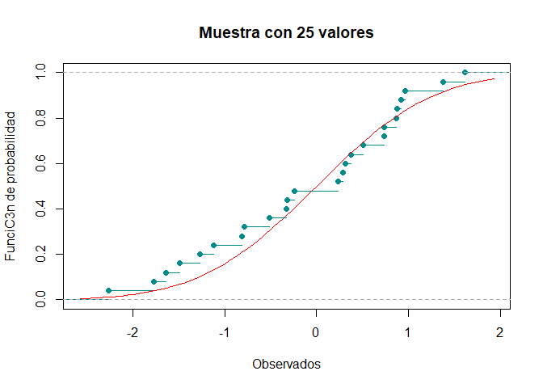

## Pruebas de bondad de ajuste
## Problema 3
La siguiente muestra aleatoria hace referencia a los rendimientos positivos de
cierta acción a lo largo del tiempo.

0.2513, 0.2566, 0.3459, 0.6379, 2.0505, 1.803, 2.1906,
1.5299, 0.35005, 0.3128, 1.2726, 2.3674, 2.3214, 2.4373, 0.6548

Llamamos a la libreria nortest para hacer la prueba lilliforce hasta el final.

```r
library(nortest)
```
Ho: La muestra sigue una distribución normal VS Ha: La muestra no sigue una distribución normal

Metemos los datos en un vector y ordenamos los datos.


```r
Dirty_data=c(0.2513, 0.2566, 0.3459, 0.6379, 2.0505, 1.803, 2.1906,
             1.5299, 0.35005, 0.3128, 1.2726, 2.3674, 2.3214, 2.4373, 0.6548)
Data=sort(Dirty_data)
```


```
##  [1] 0.25130 0.25660 0.31280 0.34590 0.35005 0.63790 0.65480 1.27260 1.52990
## [10] 1.80300 2.05050 2.19060 2.32140 2.36740 2.43730
```


Como queremos probar normalidad pero no sabemos los parámetros tenemos que estimarlos, primero queremos hacer una función para calcular la varianza muestral.


```r
S2<-function(x){
  mean_aux=mean(x)
  n_aux=length(x)
  s2=0
  for (i in x){
    s2=s2+(i-mean_aux)^2
  }
  s2=s2/(n_aux-1)
  return(s2)
}
```

Calculamos los estimadores máximos verosímiles. 


```r
mean_est=mean(Data)
S2_est=S2(Data)
n=length(Data)
```


```
## [1] 1.252137
```

```
## [1] 0.7810794
```

```
## [1] 15
```

Calculamos la función de distribución empírica necesaria para la prueba de lillieforce, donde "ecdf" es la función para crear la distribución empírica, "f_n" son los percentiles de la distribución empírica y "f_r" son los percentiles de la distribución pero desplazados una unidad. 


```r
f_emp=ecdf(Data)
f_n=f_emp(Data)
f_r=f_n-(1/n) 
```

Para para prueba de lillieforce necesitamos estandarizar los datos. 


```r
Z=(Data-mean_est)/sqrt(S2_est)
```


```
##  [1] -1.13244110 -1.12644418 -1.06285419 -1.02540173 -1.02070603 -0.69500536
##  [7] -0.67588310  0.02315415  0.31428766  0.62329879  0.90334365  1.06186602
## [13]  1.20986549  1.26191423  1.34100569
```

Ahora usaremos la función de distribución de una normal estandar para los valores antes calculados. 


```r
Probas=pnorm(Z)
```


```
##  [1] 0.1287245 0.1299888 0.1439240 0.1525868 0.1536969 0.2435260 0.2495574
##  [8] 0.5092363 0.6233487 0.7334559 0.8168282 0.8558517 0.8868347 0.8965102
## [15] 0.9100407
```


Tenemos que calcular: $$D_{i}^{+}= | \phi(Z_{i}) - \frac{i}{n}|$$  
$$D_{i}^{-}= | \phi(Z_{i}) - \frac{i-1}{n}|$$

```r
Di_p=abs(Probas-f_n)
Di_n=abs(Probas-f_r)
```

Visualizamos todos los cálculos. 


```r
Visual=data.frame(Dirty_data,Data,Z,Probas,Di_p,Di_n)
```


```
##    Dirty_data    Data           Z    Probas        Di_p       Di_n
## 1     0.25130 0.25130 -1.13244110 0.1287245 0.062057851 0.12872452
## 2     0.25660 0.25660 -1.12644418 0.1299888 0.003344555 0.06332211
## 3     0.34590 0.31280 -1.06285419 0.1439240 0.056075960 0.01059071
## 4     0.63790 0.34590 -1.02540173 0.1525868 0.114079830 0.04741316
## 5     2.05050 0.35005 -1.02070603 0.1536969 0.179636464 0.11296980
## 6     1.80300 0.63790 -0.69500536 0.2435260 0.156474028 0.08980736
## 7     2.19060 0.65480 -0.67588310 0.2495574 0.217109233 0.15044257
## 8     1.52990 1.27260  0.02315415 0.5092363 0.024096990 0.04256968
## 9     0.35005 1.52990  0.31428766 0.6233487 0.023348715 0.09001538
## 10    0.31280 1.80300  0.62329879 0.7334559 0.066789235 0.13345590
## 11    1.27260 2.05050  0.90334365 0.8168282 0.083494899 0.15016157
## 12    2.36740 2.19060  1.06186602 0.8558517 0.055851744 0.12251841
## 13    2.32140 2.32140  1.20986549 0.8868347 0.020168078 0.08683474
## 14    2.43730 2.36740  1.26191423 0.8965102 0.036823158 0.02984351
## 15    0.65480 2.43730  1.34100569 0.9100407 0.089959302 0.02329264
```

Definimos $$D^{+}= max\{D_{i}^{+}\}$$ $$D^{-}= max\{D_{i}^{-}\}$$ 
 

```r
D_p=max(Di_p)
D_n=max(Di_n)
```


```
## [1] 0.2171092
```

```
## [1] 0.1504426
```

Definimos $$D= max\{ D^{+}, D^{-} \}$$


```r
Dn=max(D_p,D_n)
```


```
## [1] 0.2171092
```


Declaramos nuestro nivel de significancia $$\alpha = 0.10$$ entonces $$1-\alpha = 0.90$$.


Comparamos con el nivel crítico $$ W_{0.10}^{15}= 0.2016 $$, para el tamaño de muestra 15 en tablas.


```r
Est=0.2016
Rechazamos_H0=Dn>Est
```


```
## [1] TRUE
```

Como $$D > W_{0.10}^{15}$$, rechazamos Ho y por lo tanto no hay evidencia para que los datos sigan una distribución $$ N(\mu,\sigma^2) $$

Hacemos la prueba en unas líneas. 


```r
p_value=lillie.test(Data)[[2]]

Rechazamos_p_value=p_value<alpha
```


```
## [1] 0.05540837
```

```
## [1] TRUE
```

Confirmando la prueba anterior. 


El gerente del banco asume que la muestra se distribuye sigue una distribución lognormal con media 0 y varianza 1. Realice la prueba correspondiente para verificar la suposición del gerente con un nivel de significancia alpha = 0.01. 

Llamamos a la función de distribución de una lognormal.


```r
ProbasB=plnorm(Data) 
```


```
##  [1] 0.0836229 0.0868775 0.1225789 0.1442074 0.1469328 0.3265089 0.3359924
##  [8] 0.5952465 0.6646554 0.7222209 0.7636471 0.7835314 0.8001537 0.8055991
## [15] 0.8135061
```

Calculamos $ D_{i}^{+}$ y $D_{i}^{-} $


```r
Di_pB=abs(ProbasB-f_n)
Di_nB=abs(ProbasB-f_r)
```

Ahora para $D^{+} \quad D^{-}$


```r
D_pB=max(Di_pB)
#Calculamos D-
D_nB=max(Di_nB)
```

Entonces obtenemos $D$

```r
DnB=max(D_pB,D_nB)
```


```
## [1] 0.1864939
```

Declaramos nuestro nivel de significancia $$\alpha = 0.01$$ entonces $$1-\alpha = 0.99$$. 


Tenemos que en tablas $$W_{0.01}^{15}=0.40420$$


```r
EstB=0.40420

Rechazamos_H0B=DnB>EstB
```


```
## [1] FALSE
```

Se cumple que $$W_{0.01}^{15} > D$$ entonces no hay evidencia para rechazar Ho, entonces 
los datos siguen una distribución lognormal con media de 1 y varianza 0.

Usamos la prueba específicando la distribución lognormal con sus parámetros.


```r
p_valueB=ks.test(Data,plnorm,0,1)[[2]]

Rechazamos_p_valueB=p_valueB<alphaB
```


```
## [1] 0.6089758
```

```
## [1] FALSE
```

Confirmamos la prueba anterior. 


## Pruebas de bondad de ajuste
## Problema 4


Un cierto banco otorga crédito a las personas con una tasa preferencial, de tal
manera que los acreditados pueden pagar en cualquier momento desde que piden
el prestamo hasta 8 semanas posteriores para que les sea respetada la tasa
preferencial . Se seleccionaron aleatoriamente a 1,000 personas y observaron su
comportamiento, generando de esta manera la siguiente tabla de frecuencia:


```r
intervalos <- c( "Menos de 1 semana","1<= x <2" , "2<= x <3","3<= x <4","4<= x <5","5<= x <6","6<= x <7","7<= x <8","Más de 8 semanas")
oi <- c(64,195,287,241,140,51,25,4,1)

tabla <- data.frame(oi,row.names = intervalos )
tabla
```

```
##                    oi
## Menos de 1 semana  64
## 1<= x <2          195
## 2<= x <3          287
## 3<= x <4          241
## 4<= x <5          140
## 5<= x <6           51
## 6<= x <7           25
## 7<= x <8            4
## Más de 8 semanas    1
```

Observamos la cantidad real de personas. 

```r
k=sum(oi)
print(k)
```

```
## [1] 1008
```

Sea X v.a. que modela semanas completas que se tarda el cliente en hacer el pago. 

Enunciamos la prueba de hipótesis: 

Ho: Se sigue una distribución Bin(n=10,p=0.25)  VS   Ha: No se sigue una distribución Bin(n=10,p=0.25)

Nuestros parámetros son: 


```r
p=0.25
n=10
```
Los datos se agruparon en nueve diferentes clasificaciones $c_{i} \quad i\in \{0,1,...,8 \}$.


```r
length(oi)
```

```
## [1] 9
```


Nuestras observaciones fueron: 


```r
oi=c(64,195,287,241,140,51,25,4,1)
```

Calculamos las probabilidades $p_{i}$ con la distribución que propusimos, se itera desde cero ya que tenemos la clasificación 0. 


```
## [1] 0.056313515 0.187711716 0.281567574 0.250282288 0.145998001 0.058399200
## [7] 0.016222000 0.003089905 0.000415802
```
Verificamos que las probas suman 1. 
$$\sum_{i=0}^{8} p_{i} = 1$$


```r
sum(Probas_ejercicio4)
```

```
## [1] 1
```
Ahora calculamos las frecuencias esperadas. 

$$n * p_{i}$$

```r
ei= Probas_ejercicio4 * k 
print(ei)
```

```
## [1]  56.7640228 189.2134094 283.8201141 252.2845459 147.1659851  58.8663940
## [7]  16.3517761   3.1146240   0.4191284
```

Podemos visualizar toda la información. 


```r
Tabla_ji = data.frame("ci"=0:8, "oi"=oi,"pi"= Probas_ejercicio4,"ei"=ei)
print(Tabla_ji)
```

```
##   ci  oi          pi          ei
## 1  0  64 0.056313515  56.7640228
## 2  1 195 0.187711716 189.2134094
## 3  2 287 0.281567574 283.8201141
## 4  3 241 0.250282288 252.2845459
## 5  4 140 0.145998001 147.1659851
## 6  5  51 0.058399200  58.8663940
## 7  6  25 0.016222000  16.3517761
## 8  7   4 0.003089905   3.1146240
## 9  8   1 0.000415802   0.4191284
```

Vamos a calcular nuestra estadística de prueba. 
$$T= \sum _{i=0}^{8} \frac{(o_{i}-e_{i})^{2}}{e_{i}}$$


```r
EstJi=0 
for (i in 1:9){
  EstJi=EstJi+(((oi[i]) - (ei[i]))^2)/(ei[i])
}
print(EstJi)
```

```
## [1] 8.670518
```
Se comienza el ciclo desde 1 hasta 9 ya que son las entradas de los vectores, no son las clasificaciones. 

Para un nivel de confianza $\alpha = 0.01 $ tenemos que $1-\alpha = 0.99$. 


```r
alpha_ejercicio4=0.01
conf_ejercicio4= 1- alpha_ejercicio4
```

Necesitamos los grados de libertad, que es el número de clasificaciones menos uno, ya que no estimamos parámetros. 


```
## [1] 8
```
Calculamos el cuantil ${\chi}^2_{8,\ 0.99}$.

```r
valor_critico=qchisq(conf_ejercicio4,df=v,lower.tail = TRUE)
```
Comparamos la estadística de prueba con el valor crítico. 

```r
Rechazamos_H0_p4=EstJi>valor_critico
print(Rechazamos_H0_p4)
```

```
## [1] FALSE
```

No hay evidencia pra decir que los datos no siguien una distribución binomial con n=10 y p=0.25, entonces aceptamos Ho. 

Para comprobar los cálculos usemos la prueba que vienen en la libreria nortest. 


```r
p_value_p4=chisq.test(x=oi,p=Probas_ejercicio4)[[3]]
```

```
## Warning in chisq.test(x = oi, p = Probas_ejercicio4): Chi-squared approximation
## may be incorrect
```

```r
Rechazamos_p_value_p4=alpha_ejercicio4>p_value_p4
print(Rechazamos_p_value_p4)
```

```
## [1] FALSE
```
No rechazamos Ho. 

## Pruebas de bondad de ajuste
## Problema 5


En R fije la semilla 2019, y genera 25 observaciones distribuidas como una N(0; 1)
y con ella realiza:

Calcula y gráfica la función de distribución empírica de las observaciones
generadas.

Agrega sobre esa misma gráfica, la curva de la distribución verdadera (N(0; 1)).
A partir de las gráficas anteriores ¿La función de distribución empírica es
similar a la distribucin teórica de los datos?.

Vuelve a fijar la semilla 2019, y genera un millón de observaciones distribuidas como una N(0; 1) y con ello realiza:

Calcula y gráfica la función de distribución empírica de las observaciones generadas.

Agrega sobre esa misma gráfica, la curva de la distribución verdadera (N(0; 1)).
A partir de las gráficas anteriores ¿La función de distribución empírica es similar a la distribución teórica de los datos?.

Realiza la diferencia entre el valor de la función empírica y la función real,
(Hint: no olvides que debes ordenar de menor a mayor los valores de la distribución conocida y sólo mostrar los primeros 5 y los últimos 5 resultados)

¿Al ser una muestra mucho mayor que al anterior a que teorema te recuerda
el resultado obtenido?.


Para la primera parte del ejercicio fijemos la semilla inicial.

```r
set.seed(2019)
```

Obtengamos 25 datos de una distribución normal estándar.

```r
x_data=rnorm(25,mean=0,sd=1)
print(x_data)
```

```
##  [1]  0.7385227 -0.5147605 -1.6401813  0.9160368 -1.2674820  0.7382478
##  [7] -0.7826228  0.5092959 -1.4899391 -0.3191793 -0.2379111  1.6186229
## [13] -1.1176011  0.2340028  0.3161516  0.3707686  0.8775886 -1.7683235
## [19] -0.3271264 -2.2632252  0.2855605  0.9684286  0.8673066  1.3781350
## [25] -0.8082596
```
Calculemos la función de distribución empírica y obtengamos su gráfica.


```r
f_empi=ecdf(x_data)
plot(f_empi, xlab="Observados", ylab="Función de probabilidad", 
     main="Muestra con 25 valores", col="darkcyan")
curve(pnorm(x), add=TRUE, col="red")
```

<!-- -->


Las funciones se parecen aunque pareciera que el error el algo grande ya que no son idénticas, del lado de los negativos se aprecia más despegada en cambio para valores mayores a cero se ajustan mejor a la función de distribución de una $N(0,1)$. 

Vamos con la segunda parte del ejercicio, primero volvemos a fijar la semilla. 


```r
set.seed(2019)
```

Generamos un millón de datos de una distribución $N(0,1)$.


```r
x_dataM = rnorm(10^6)
```
Calculamos la función de distribución empírica $F_{n}$


```r
x_dataM = rnorm(10^6)
f_empiM = ecdf(x_dataM)
```

Veamos las gráficas: 


```r
plot(f_empiM, xlab="Observados", ylab="Función de probabilidad", 
     main="Muestra con 10^6 valores", col="darkcyan")
curve(pnorm(x), add=TRUE, col="red")
```

<!-- -->

En este caso para una muestra de tamaño $10^6$, ambas funciones se parecen mucho, apenas se alcanzan a ver los puntos en los que difieren. 

Trabajemos con la muestra tamaño 25, ahora vamos a ver como se comportan los datos en relación con la función empírica y real, primero debemos ordenar los datos.


```r
x_data_ord=sort(x_data)
f_empi_norm=f_empi(x_data_ord)
```

Calculemos la función empírica con un lugar desfasado (salto de $\frac{1}{25}$).


```r
f_empi_des=f_empi_norm - (1/25)
```

Calculemos las probabilidades de la muestra suponiendo una distribución $N(0,1)$. 


```r
probras_data = pnorm(x_data_ord)
```

Primero vamos con $D^{+}$.


```r
D_data_norm = f_empi_norm - probras_data
D_data_max = max(D_data_norm)
print(D_data_max)
```

```
## [1] 0.1081313
```

Ahora para $D^{-}$


```r
D_data_des = probras_data - f_empi_des
D_data_des_max = max(D_data_des)
print(D_data_des_max)
```

```
## [1] 0.1125086
```
Ahora calculamos $D = max \{D^{+},D^{-}  \}$.


```r
D_max= max(D_data_max,D_data_des_max)
print(D_max)
```

```
## [1] 0.1125086
```
Veamos la información:


```r
tabla_25= data.frame()
print(D_max)
```

```
## [1] 0.1125086
```


